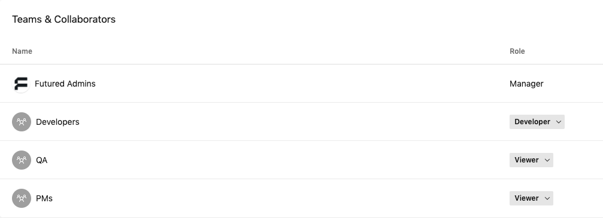

# New project checklist

## 1. Create new repository

- [ ] Open [Android project template](https://github.com/thefuntasty/android-project-template) and use it to create new repository. Preferred repo name is *[productname]-android*, where *[productname]* includes only name of the product, without client name.

- [ ] Change following in newly created repository:
    - Update Readme.md
    - Change project name to real project name
    - Change applicationId
    - Change packages from `com.thefuntasty.androidprojecttemplate` to real packages based on applicationId

- [ ] Create `develop` branch and set it as a default branch.

- [ ] Disable **Wiki**, **Issues**, **Projects** features we do not use.

- [ ] Enable **Automatically delete head branches** so there is no need to delete branches manually after each PR merge.

- [ ] Set branch protection rules to `develop` and `master` branches exactly as shown in the following screenshot:

> (NOTE: Status checks (GitHub Actions, Danger, etc.) become visible after first created pull request. Do not forget to set them afterwards.

- [ ] Create new branch `feature/PROJ-1-setup-project` where everything will be set up in next steps.

## 2. Create application in App Center

- [ ] Add new application in [App Center admin](https://appcenter.ms/apps/create?os=Android). Owner should be set to Futured. Release type should be set to Enterprise.

- [ ] Assign all teams (Developers, QA, PMs) to new application in Settings > People section:

- [ ] If necessary add partners following the [AppCenter - How to add access to partners](../general/appcenter-how-to-add-partner-account.md) guide.

## 3. Configure GitHub Actions

- [ ] If you created a new project using [Android project template](https://github.com/thefuntasty/android-project-template), the GitHub Actions workflow files are already present in your repository under `.github/workflows` folder. If not, copy them over from [here](https://github.com/futuredapp/android-project-template/tree/master/.github/workflows).
- [ ] In **Settings** tab of your repository, go to **Secrets** and configure following secrets:
  1. `DANGER_GITHUB_API_TOKEN`
  2. `SLACK_WEB_HOOK`
  3. `APP_CENTER_TOKEN`
- [ ] For each workflow configuration file, configure the environment variables marked with `TODO` comment:
  1. `SLACK_CHANNEL`
  2. `APPCENTER_APP_NAME`
- [ ] Make a pull request from `feature/PROJ-1-setup-project` to `develop` to ensure that GitHub Actions work properly

## 4. Enjoy!
