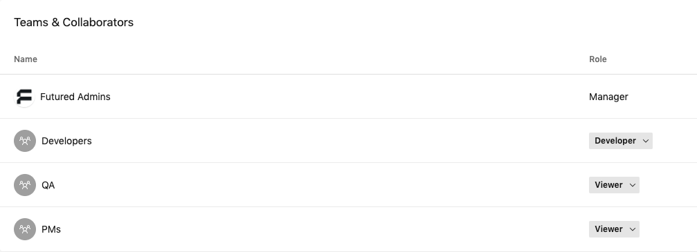

# New project checklist

## 1. Create new repository

- [ ] Open [Android project template](https://github.com/thefuntasty/android-project-template) and use it to create new repository. Preferred repo name is *[productname]-android*, where *[productname]* includes only name of the product, without client name.

- [ ] Change following in newly created repository:
    - Update Readme.md
    - Change project name to real project name
    - Change applicationId
    - Change packages from `com.thefuntasty.androidprojecttemplate` to real packages based on applicationId

- [ ] Create `develop` branch and set is as a default branch.

- [ ] Disable **Wiki**, **Issues**, **Projects** features we do not use.

- [ ] Enable **Automatically delete head branches** so there is no need to delete branches manually after each PR merge.

- [ ] Set branch protection rules to `develop` and `master` branches exactly as shown in the following screenshot:

> (NOTE: Status checks (Bitrise, Danger, etc.) become visible after first created pull request. Do not forget to set them afterwards.

- [ ] Create new branch `feature/PROJ-1-setup-project` where everything will be set up in next steps.

## 2. Create application in App Center

- [ ] Add new application in [App Center admin](https://appcenter.ms/apps/create?os=Android). Owner should be set to Futured. Release type should be set to Enterprise. 

- [ ] Assign all teams (Developers, QA, PMs) to new application in Settings > People section:

- [ ] If necessary add partners following the [AppCenter - How to add access to partners](https://github.com/thefuntasty/developer-handbook/blob/master/appcenter-how-to-add-partner-account.md) guide. 

## 3. Configure Bitrise CI

- [ ] Create a new Bitrise app by manually inserting GitHub SSH URL. Use "Add own SSH" option and paste our Bitrise-dedicated GitHub SSH key (can be found in 1Password vault). In Project build configuration step, select the manual one since our unified configuration will be pasted manually later. Skip the Webhook registration it will be added later too. 

- [ ] In **Team tab**, select `thefuntasty-ops` as the Service credential User and make sure The `Funtasty Digital s.r.o.` is the owner of the project. Add `Funtasty Developers` group as developers to the project.

- [ ] In **Code tab**, make sure Incoming Webhooks are set to `Github (Code Push, Pull Request, Tag Push)`, then go to GitHub repo and set up the webhook for the url shown on Bitrise. Activate the hook for *Pull requests* and *Pushes* events.

- [ ] In **Settings tab** disable all of the email notifications.

- [ ] In **Workflow tab**, instead of manually configuring the workflows using the GUI, use the initial [bitrise.yml](attachments/bitrise.yml) file.

- [ ] Configure following Secret Environment Variables:
    - `AWS_SECRET_KEY`
    - `AWS_ACCESS_KEY`
    - `KEY_PASSWORD`
    - `STORE_PASSWORD`
    - `DANGER_GITHUB_API_TOKEN`
    - `APPCENTER_API_TOKEN`
    - `SLACK_HOOK_URL`

- [ ] Configure Environment Variables:
    - `PACKAGE_NAME`
    - `SLACK_CHANNEL`
    - `APPCENTER_NAME`
    - `APP_CENTER_DISTRIBUTION_GROUPS`

- [ ] Finally, run test builds on Bitrise.

## 4. Enjoy!
