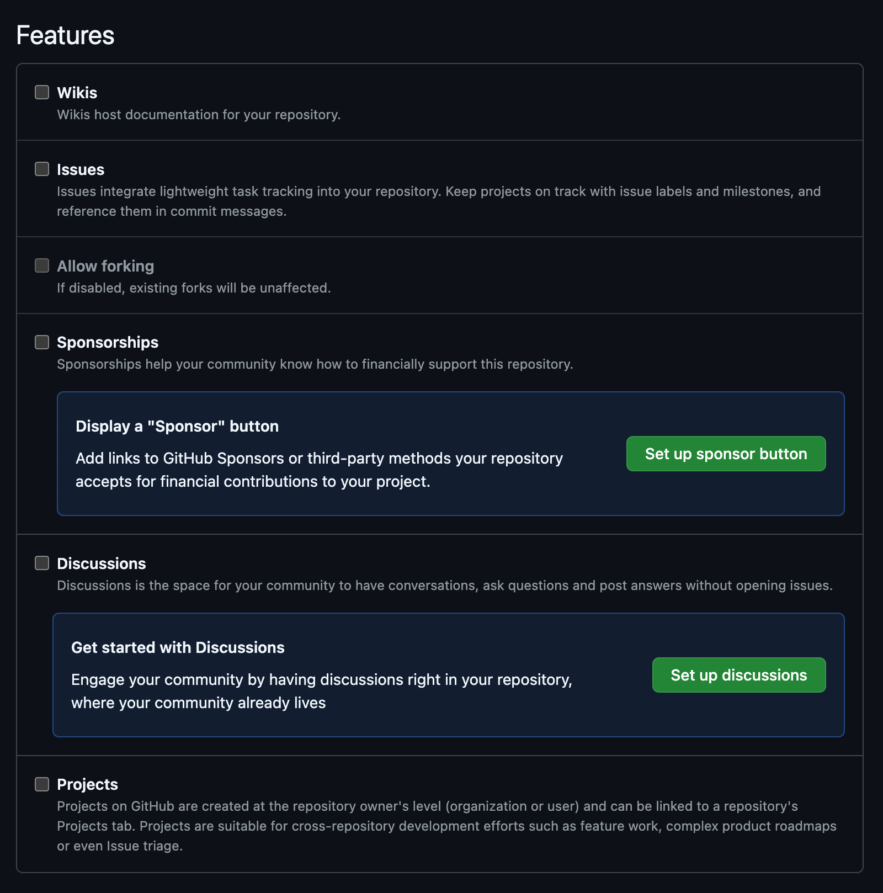
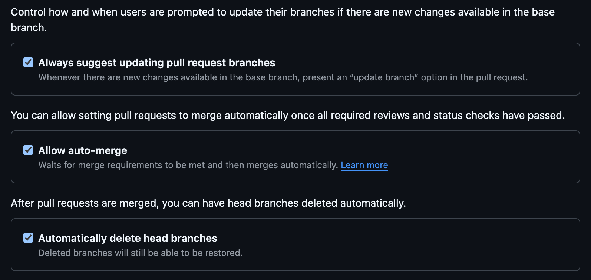
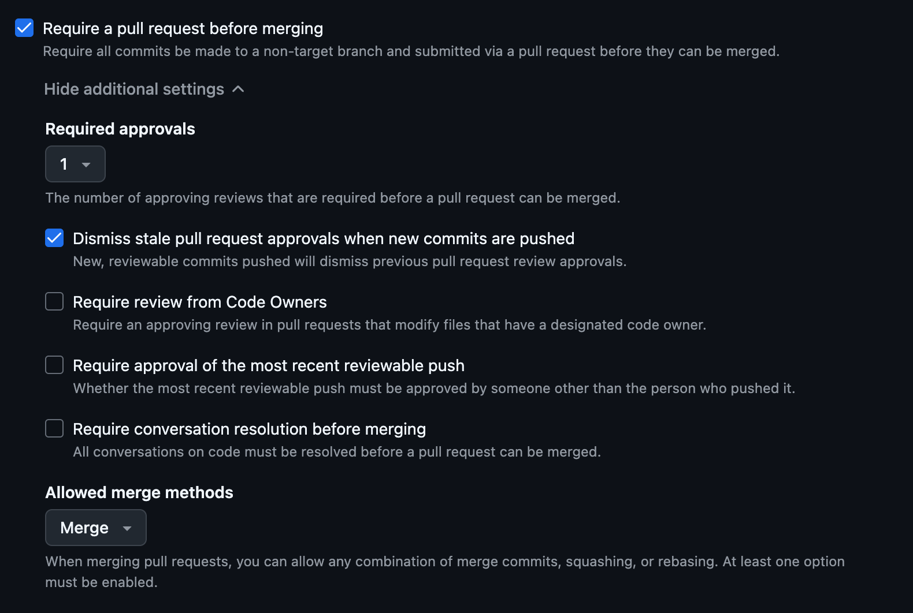
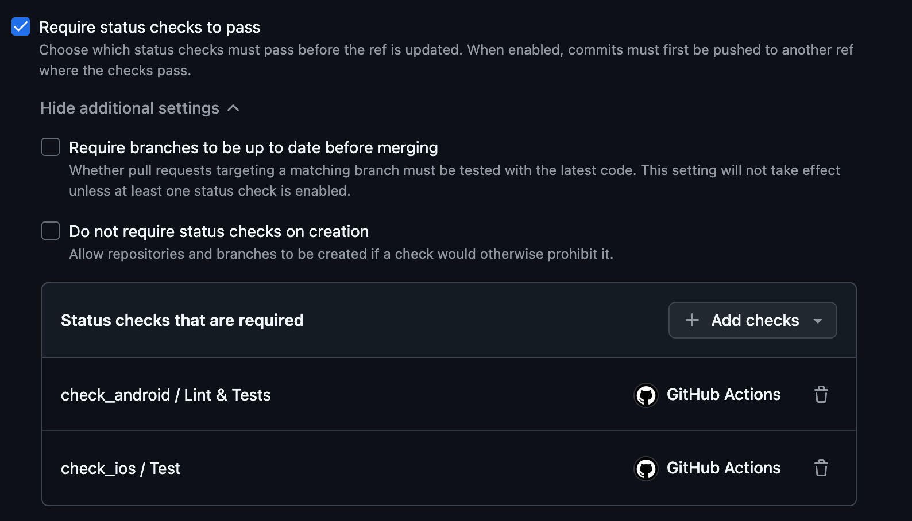

# GitHub Settings
Let's set up a GitHub repository for your project.

## General Settings
First, let's start by configuring basic repository settings in `Settings > General`:

1. Create a `develop` branch and set it as the default branch.
2. Disable all features: Wikis, Issues, Sponsorships, Discussions and Projects.

    

3. Pull Request settings: 
    - Enable `Allow merge commits`

    

    - Enable `Always suggest updating pull request branches`
    - Enable `Allow auto-merge`
    - Enable `Automatically delete head branches`

    

## Branch Rulesets

Branch rulesets are important for protecting your codebase and ensuring code quality. They prevent accidental or unauthorized changes to the `develop` and `main` branches.

What is required:

- Pull requests are the only way to merge new code to any of the protected branches.
- Pull requests must be reviewed by at least one person (this rule can be adjusted based on the project).
- Status checks (CI) must pass before merging.

### Configuration

Open `Settings > Rules` and click `New Ruleset > New branch ruleset`.

1. Name: "Pull Requests" (or something more suitable if you're creative)
2. Target branches:
    - Default branch (Include default branch)
    - `main` branch (Include by pattern)
3. Branch rules
    - Enable `Restrict deletions`
    - Enable `Require a pull request before merging`. Then under `Additional settings`:
        - Set Required approvals: `1` or more (this might be project-specific)
        - Enable `Dismiss stale pull request approvals when new commits are pushed` (this might be project-specific)

        

    - Enable `Block force pushes`
    - Enable `Require status checks to pass`. Then under `Additional settings`:
        - Select all CI status checks that run for pull requests

        !!! tip
            Status checks become visible after they have been run at least once (after the first created pull request). Do not forget to set them afterwards.

        
