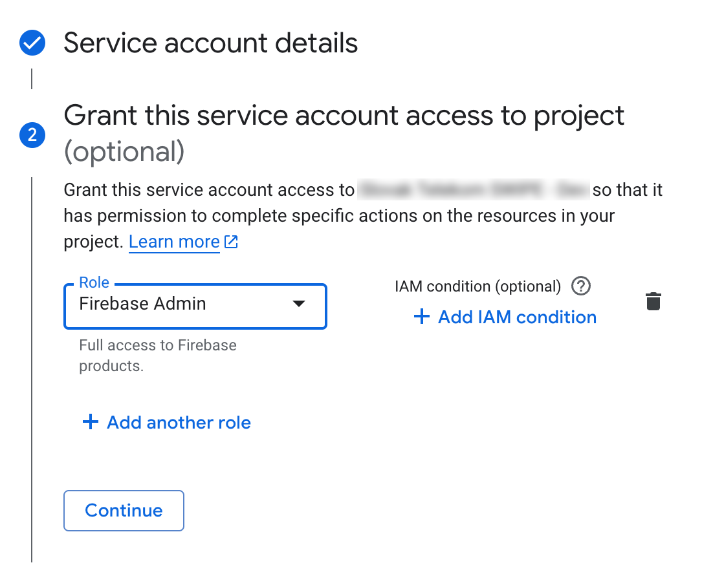

# Firebase

Our mobile application projects use a dual Firebase setup, meaning there are ideally two Firebase projects - one for the development environment and one for the production environment.

!!! question "Why two Firebase projects?"
    Separate dev and prod Firebase projects provide several benefits:

    - **Clean Analytics**: Developer testing won't contaminate real user data.
    - **Access Control**: You can control who accesses each environment, limiting who can touch production while letting developers work freely in the dev environment.
    - **Safe Testing**: Test notifications without reaching real users. Experiment with remote config in development first.
    - **Environment Consistency**: Many third-party services themselves split their environments into development and production, allowing you to connect to their test/sandbox accounts in your dev environment while using real/production accounts in your production environment.

    This separation creates a safety buffer between development activities and your production users.

During project setup, you either need to create new Firebase projects or gain access to existing project(s) from the client.

## New project

Create new Dev and Prod projects using **ops@futured.app** email and invite all necessary collaborators with roles set using [principle of least privilege](https://www.cloudflare.com/en-gb/learning/access-management/principle-of-least-privilege/).

When creating new projects, follow the naming convention:

- Dev project: `<Project Name> - Dev`
- Production project: `<Project Name>`

For production project in `Project settings > General`, set the Environment type to `Production`.

{: style="height:auto;width:auto;max-height:200px"}

!!! info "Firebase vs. Google Cloud"
    Each Firebase project comes with Google Cloud project. When working with 3rd party integrations which require you to integrate with Google Cloud, be aware of this and use existing Google Cloud project if possible.

    **Example:** For setting up Google Sheets API key for localizations, create this key in dev Firebase Google Cloud project. For setting up Google Play developer API in CI/CD, use production Firebase Google Cloud project.

## Existing project

If there's an existing Firebase project, request that the client invite **ops@futured.app** ideally with project owner permissions, or at least with permissions to add members and manage necessary Firebase features.

If only one project exists, treat it as the Production environment. In this case, create a new Development project following the guidelines in the [New project](#new-project) section to maintain our dual-environment approach.

## Applications setup

Integrate Firebase into the application by following [official docs](https://firebase.google.com/docs/android/setup).

There should be 3 application build types, where `debug` and `enterprise` have an applicationId suffix.
Register these apps in Firebase:

- **`debug`**
    - applicationId suffix `debug` (eg. `app.futured.kmptemplate.debug`)
    - register app in **Dev Firebase project**
- **`enterprise`**
    - applicationId suffix `enterprise` (eg. `app.futured.kmptemplate.enterprise`)
    - register app in **Dev Firebase project**
- **`release`**
    - no suffix
    - register app in **Production Firebase project**

### SHA certificate fingerprints

Each application in Firebase must have SHA fingerprints configured.

#### Debug + Enterprise app

Fingerprints can be obtained from the debug keystore.

!!! tip
    You can get the SHA-1 by running `keytool -list -v -keystore debug.keystore -alias androiddebugkey -storepass android`. Adjust file paths.

#### Release app

You will probably be using [Play App Signing](https://support.google.com/googleplay/android-developer/answer/9842756?hl=en) to sign the release build of your app. Don't forget to fill in the SHA-1 later. You'll be able to find the SHA-1 in the Google Play Console.

Please refer to the [Setup app in Google Play Console](../release/10_setup_app_google_play_console.md) page for more info.

## Firebase features

By default, each project must use Firebase App Distribution. We use Firebase App Distribution to distribute builds for QA and clients. Refer to the [Build distribution](../development/20_build_distrubution.md) page for more info.

### Firebase App Distribution

Enable Firebase App Distribution in Dev Firebase project for Enterprise build type. Set up Firebase App Distribution Gradle Plugin using [Distribute Android apps to testers using Gradle](https://firebase.google.com/docs/app-distribution/android/distribute-gradle?apptype=apk) guide.

#### Authentication with Firebase

Our CI workflows authenticate with Firebase using [Service account credentials](https://firebase.google.com/docs/app-distribution/android/distribute-gradle?apptype=apk#service-acc-gradle). Follow this guide, creating a service account key in **Dev Firebase Google Cloud project**:

1. Go to [Google Cloud Console](https://console.cloud.google.com/) and select your Firebase project
   
    !!! tip "Pro tip"
        If you're unsure which project to choose, you can open up your **Dev Firebase project**, go to `Project Settings > Service accounts` and click `Manage service account permissions 🔗` which will open up your project's Google Cloud Console, right at the Service accounts page.

2. Create a new Service account with descriptive name and description
   {: style="height:auto;width:auto;max-height:420px"}

3. Assign the "Firebase Admin" role to this account
   {: style="height:auto;width:auto;max-height:420px"}

4. Click Done, navigate to that account, and create a new JSON key in `Keys > Add key`.
5. Copy contents of this key into `APP_DISTRIBUTION_SERVICE_ACCOUNT` repository secret in GitHub and delete the JSON file from your disk.

More info about CI/CD setup is in the [CI/CD](./40_ci_cd.md) page.

!!! tip "Pro tip"
    If you forgot to assign the "Firebase Admin" role to your service account, you can do that in `IAM & Admin > IAM` menu of Cloud Console by clicking the `Edit principal` icon next to service account.

#### Create distribution groups

The last thing to set up is Distribution groups. Create three App Distribution distribution groups:

- `futured-devs`
- `futured-qa`
- the last one will be for client

Invite collaborators to distribution groups. You can also create an invite link. You will reference the devs and QA groups from CI/CD pipelines.

{: style="height:auto;width:auto;max-height:200px"}

### Crashlytics

If you decide to use Firebase Crashlytics, make sure to disable [mapping file upload](https://firebase.google.com/docs/crashlytics/get-deobfuscated-reports?platform=android#keep-obfuscated-build-variants) for debug builds.:
```kotlin
buildTypes {
    getByName("debug") {
        configure<CrashlyticsExtension> {
            mappingFileUploadEnabled = false
        }
    }
}
```
