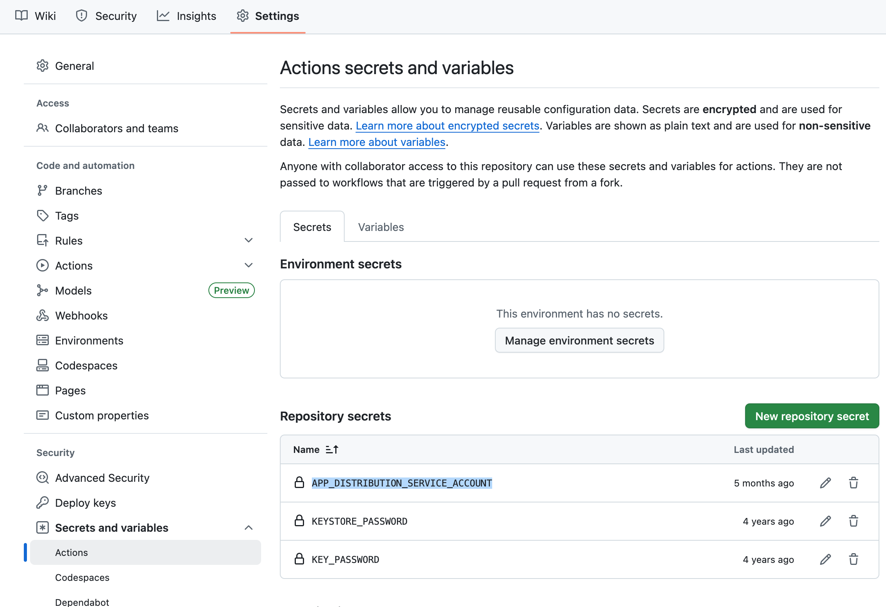

# CI/CD

Projects created from our templates have default GitHub Actions configuration that contains workflows for pull request checks, Enterprise build distribution, and release on Google Play Store.

Default configuration uses shared workflows for this purpose.

## Workflow Overview

The CI/CD setup consists of three main workflows:

1. **PR Check Workflow** - Runs on every pull request
2. **Enterprise Workflow** - Runs on pushes to `develop` branch  
3. **Release Workflow** - Runs when a GitHub release is created

## Android Native Projects

### PR Check Workflow

**[PR Check workflow](https://github.com/futuredapp/.github/blob/main/.github/workflows/android-cloud-check.yml)** - This workflow is triggered every time a pull request is created and doesn't require any additional configuration. The main purpose of this workflow is to run lint checks and unit tests. If major shortcomings are found or unit tests are not passing, this workflow will fail and PR merge will be blocked until it's resolved.

**What it does:**
- Runs linting checks
- Executes unit tests
- Validates code quality
- Blocks PR merge if checks fail

### Enterprise Workflow

**[Enterprise workflow](https://github.com/futuredapp/.github/blob/main/.github/workflows/android-cloud-release-firebaseAppDistribution.yml)** - This workflow is triggered after push/merge to the `develop` branch. It produces an Enterprise build (internal testing build) and publishes it to Firebase App Distribution for testing.

**Required Setup:** described in [## Setup Requirements](#setup-requirements) section

**What it does:**
- Builds the app in enterprise build variant 
- Signs the APK with development key
- Uploads to Firebase App Distribution

### Release Workflow

The release workflow is triggered when a GitHub release is created. It builds a production-ready app bundle and uploads it to Google Play Console.

**Required Setup:** described in [## Setup Requirements](#setup-requirements) section

**What it does:**
- Builds signed release AAB
- Uploads to Google Play Console

## KMP (Kotlin Multiplatform) Projects

Multiplatform projects contain similar workflows as native projects with additional optimization for change detection.

### Change Detection

Before running the PR Check workflow, KMP projects use a **[detect changes](https://github.com/futuredapp/.github/blob/main/.github/workflows/kmp-cloud-detect-changes.yml)** job to determine if Android/KMP code has been modified. This prevents unnecessary CI/CD runs when only iOS code has changed.

**How it works:**
- Analyzes changed files in the PR
- Checks if Android/KMP source files were modified
- Only triggers Android workflows if relevant changes are detected
- Saves GitHub Actions runner time and resources

### Workflow Differences

- **PR Check Workflow**: Same as native projects, but only runs if Android/KMP changes are detected
- **Enterprise Workflow**: Same as native projects, but includes jobs for Android and also iOS
- **Release Workflow**: Same as native projects,  but includes jobs for Android and also iOS

## Setup Requirements

### For Enterprise Workflow

!!! info "About Permissions"

    If you don't have necessary permissions to perform any of the steps described below, feel free to ask your tech leader for permissions and/or help.

- `APP_DISTRIBUTION_SERVICE_ACCOUNT` secret in GitHub repository settings
- Firebase project configured (see [Firebase Setup](./30_firebase.md))

### For Release Workflow
- Complete setup described in [Release CI/CD Guide](../release/20_ci_cd.md)
- Google Play Console access
- App signing keys and passwords
- Google Cloud service account
