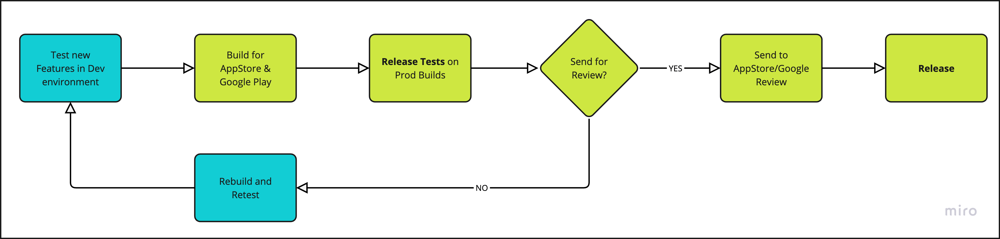

# Release Process

## Introduction

The release process involves creating a release branch, merging it to main, and triggering the CI/CD pipeline to publish the app to Google Play Console. For general guidelines on working with branches, review [Git flow](https://www.gitkraken.com/learn/git/git-flow).

We usually use [Semantic Versioning](https://semver.org/) (`x.x.x`)

## Release Flow Diagram

## Release Flow

1. Create a release branch:
      - Branch name format: `release/<version>`
      - Create from: `develop` branch
      - Merge any release-specific fixes to this branch

2. Create a Pull Request:
      - From: `release/<version>`
      - To: `main`
      - PR name format: `Release <version>`

3. Wait for:
      - PR approval
      - CI checks

4. After merge to `main`, create a new GitHub release:
      - Tag name format: `<version>`
      - Generate release notes

5. Wait for CI to build the release

6. Verify the release build in:
      - Firebase Console
      - Google Play Console

7. Publish to test channels (depending on project needs):
      - Internal testing (default)
      - Closed testing (optional)
      - Open testing (optional)

8. Notify the client about the test release

9. After client approval, publish to production