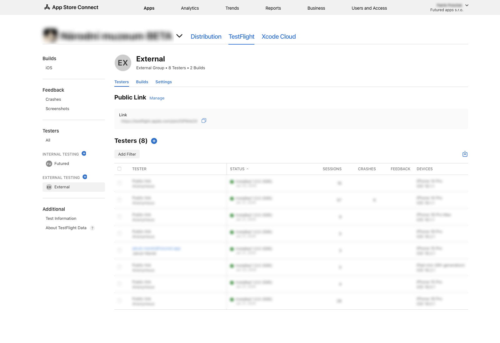

# Build distribution

There are three build configurations.
    
## Debug builds

Debug builds are created in Xcode by developers. See project readme to find how you can create a debug build.

## Beta builds

Beta builds are mainly used by our QA team. There's possibility to add beta build to external testing and share it via link or email invitation if needed (see attached screenshot). External beta build has to go through app review. It can take longer for the first build or after some longer period without uploading a new build but it's usually approved immediately. Always send tested builds to external testing!

Although it is possible to invite external users to Futured's App Store Connect and add them to internal testing we prefer external testing for the following reasons:

- internal builds are automatically submited with merged pull request => these builds should be tested first which cannot be guaranteed in internal testing
- security concerns

{ width="900" }

## Production builds

Production builds can be either distributed via Futured's or customer's App Store Connect account. It is also possible to set up ASC account later and migrate the app (see [docs](https://developer.apple.com/help/app-store-connect/transfer-an-app/overview-of-app-transfer/)) but we strongly recommend to make a decesion before releasing the first version.

??? info "App Store submission - first release requirements:"

    Here's a list of requirements to be able to successfuly submit the very first build to app review:

    - release build in TestFlight
    - app icon
    - name (limit 17 chars)
    - subtitle (optional, limit 30 chars)
        - a summary of your app that will appear under your app's name on your App Store product page
    - screenshots iPhone 6.9", iPad (if supported) 13"
    - promotional text (optional, limit 170 chars) 
        - promotional text lets you inform your App Store visitors of any current app features
        without requiring an updated submission
    - description (limit 4000 chars)
        - a description of your app, detailing features and functionality
    - keywords (limit 100 chars)
        - include one or more keywords that describe your app
        - keywords make App Store search results more accurate
        - separate keywords with an English comma
    - support URL
    - marketing URL (optional)
    - privacy policy URL
    - user privacy choices URL (optional)
        - a URL where users can modify and delete the data collected from the app, 
        or decide how their data is used and shared
    - copyright
        - the name of the person or entity that owns the exclusive rights to your app, 
        preceded by the year the rights were obtained (for example, "2008 Acme Inc.")
        - do not provide a URL
    - test account sign in credentials for app review (if there's an account in the app)
    - contact information
        - first, last name
        - phone, email
    - category
        - primary
        - secondary (optional)

[**How to build a production build**](ios_release.md/#source-control-steps-to-release)
