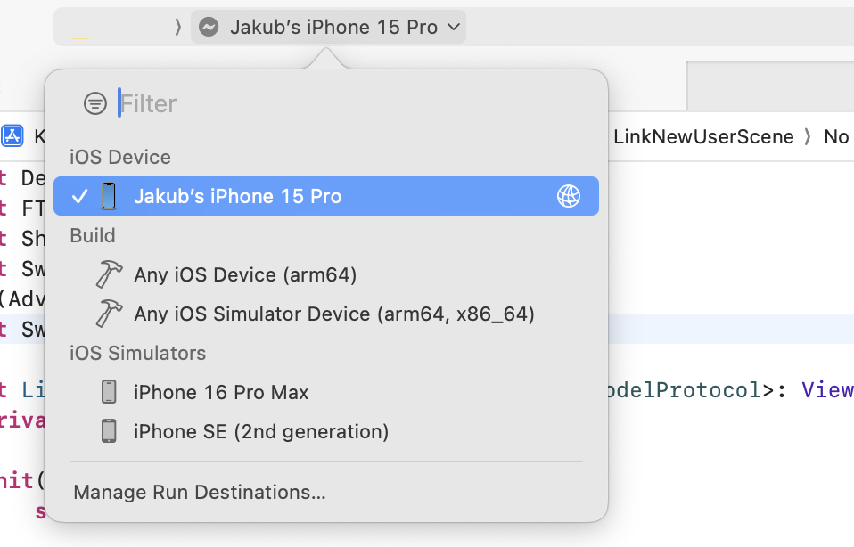

# Builds

There are three build configurations.
    
## Debug builds

Debug builds are created in Xcode by developers.

### How to run a debug build on device

1. Environment setup - follow the well-written and maintained manual [here](https://www.moncefbelyamani.com/how-to-install-xcode-homebrew-git-rvm-ruby-on-mac/)

2. From Terminal in the project folder:

    - install necessary ruby tools:
        ```bash
        bundle install
        ```

    - download development certificate and provisioning profiles:
        ```bash
        bundle exec fastlane provisioning
        ```

3. Build using Xcode, select your device in run destinations

    { width="900" }

??? info "Haven't you registered your iOS device yet? Follow these instructions."
    ## Adding to list of devices
    
    To be able to run a debug build on your device you need to add it to the company's private fastlane repository. Update file `device-list.txt` file. See closed PRs for inspiration or follow these steps:

    Each device has to have three columns **separated by tabs**.

    1. Device UDID
    2. Descriptive name of the device
    3. Operation system

    `UDID	Owner - Device model	ios/mac`

    ### Regenerating the profiles for new devices

    Project profiles won't regenerate automatically after adding a new device. To regenerate the profiles, follow these steps:

    1. Retrieve the ops Apple ID password from Bitwarden
    2. Ask someone with ops access to provide you with an authentication code
    3. In the project directory, call the following command from Terminal:
        ```bash
        MATCH_FORCE=true bundle exec fastlane update_provisioning
        ```

        _If `MATCH_FORCE` environment variable is not provided the profiles are updated only when invalid._

## Beta builds

Beta builds are mainly used by our QA team. There's possibility to add beta build to external testing and share it via link or email invitation if needed (see attached screenshot). External beta build has to go through app review. It can take longer for the first build or after some longer period without uploading a new build but it's usually approved immediately. Always send tested builds to external testing!

Although it is possible to invite external users to Futured's App Store Connect and add them to internal testing we prefer external testing for the following reasons:

- internal builds are automatically submited with merged pull request => these builds should be tested first which cannot be guaranteed in internal testing
- security concerns

{ width="900" }

## Production builds

Production builds can be either distributed via Futured's or customer's App Store Connect account. It is also possible to set up ASC account later and migrate the app (see [docs](https://developer.apple.com/help/app-store-connect/transfer-an-app/overview-of-app-transfer/)) but we strongly recommend to make a decesion before releasing the first version.

??? info "App Store submission - first release requirements:"

    Here's a list of requirements to be able to successfuly submit the very first build to app review:
    
    ### Xcode project

    - app icon
    
    ### App Store Connect
    
    - release build in TestFlight
    
    #### `X.Y Prepare for Submission` section:
    
    - screenshots iPhone 6.9", iPad (if supported) 13"
    - Promotional text (optional, limit 170 chars)
        - promotional text lets you inform your App Store visitors of any current app features without requiring an updated submission
    - Description (limit 4000 chars)
        - a description of your app, detailing features and functionality
    - Keywords (limit 100 chars)
        - include one or more keywords that describe your app
        - keywords make App Store search results more accurate
        - separate keywords with an English comma
    - Support URL
    - Marketing URL (optional)
    - Copyright
        - the name of the person or entity that owns the exclusive rights to your app, 
        preceded by the year the rights were obtained (for example, "2008 Acme Inc.")
        - do not provide a URL
    - build (select uploaded build from TestFlight)
    - App Review Information (if applicable)
        - test account sign in credentials for app review (if there's an account in the app)
        - contact information
            - first, last name
            - phone, email
    
    #### `General` -> `App Information` section:
    
    - Name (limit 17 chars)
    - Subtitle (optional, limit 30 chars)
        - a summary of your app that will appear under your app's name on your App Store product page
    - Content Rights
    - Category
        - Primary
        - Secondary (optional)
    - Age Rating
    
    #### `App Store` -> `TRUST & SAFETY` -> `App Privacy` section:
    
    - Privacy Policy URL
    - User Privacy Choices URL (optional)
        - a URL where users can modify and delete the data collected from the app, 
        or decide how their data is used and shared
    - privacy nutrition labels
        - click `Get Started` button
        
    #### `App Store` -> `MONETIZATION` -> `Pricing and Availability` section:
    
    - Price Schedule
        - click `Add Pricing` button
    - App Availability
        - click `Set Up Availability` button
    - iPhone and iPad Apps on Apple Silicon Macs
        - Apple Silicon Mac Availability

[**How to build a production build**](ios_release.md/#source-control-steps-to-release)
