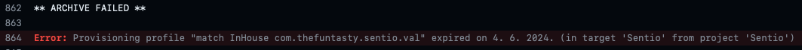
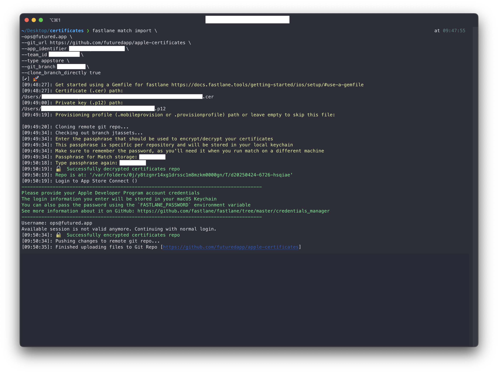

# CI/CD
    
## Renew provisioning profile

{ width="900" }

In the case of an expired provisioning profile (see the attached CI error screenshot 👆) or when adding capabilities, it is necessary to take the following steps:

- delete provisioning profile in the Apple Developer portal
- for renew expired profile run:
    ```bash
    bundle exec fastlane update_provisioning # for debug/beta configuration
    ```
    ```bash
    bundle exec fastlane update_release_provisioning # for release configuration
    ```

- for renew profile after adding capabilities run:
    ```bash
    MATCH_FORCE=true bundle exec fastlane update_provisioning # for debug/beta configuration
    ```
    ```bash
    MATCH_FORCE=true bundle exec fastlane update_release_provisioning # for release configuration
    ```

## Renew certificate

{ width="900" }

In the case of an expired certificate (see the attached CI error screenshot 👆), it is necessary to take the following steps:

- delete provisioning profiles related to the given certificate in the Apple Developer portal
    - there's no need to delete the certificate itself, it will be removed automatically

- remove the corresponding development or distribution certificate (both the `.cer` and `.p12` files) from the `futured/apple-certificates` repository

    { width="500" }

    - for Futured account, find it in the default branch
    - for client's account, find it in the appropriate branch
    - open a PR pointing to the right branch, you can merge it immediately

- for renew expired certificate and corresponding profiles run:
    ```bash
    bundle exec fastlane update_provisioning # for debug/beta configuration
    ```
    ```bash
    bundle exec fastlane update_release_provisioning # for release configuration
    ```
    
##  Adding existing certificate to the `futured/apple-certificates` repository

It might be necessary if the client has reached the maximum number of generated certificates on their Apple Developer account.

Prerequisites:

- `.cer` file
- `.p12` file (SSL certificate with its private key within a single encrypted file)
    - it's possible the file is password protected, you need to know the password and remove it
        - import it into your keychain
        - export it from keychain without a password
        

Clients or previous suppliers should be able to provide this. Note that the certificate can be downloaded from the Apple Developer account, but only the `.cer` file. If the `.p12` file is not available, a new certificate must be created and stored securely with its private key.

**After you obtain necessary files store them to Futured's Bitwarden.**
    
Steps:

1. Create a project branch in `futured/apple-certificates` repository
2. Import the certificate with following script:
    ```bash
    fastlane match import \
    —ops@futured.app \
    --git_url https://github.com/futuredapp/apple-certificates \
    --app_identifier app.futured.xyz \ # replace app_identifier
    --team_id XYZXYZXYZX \ # replace team_id
    --type appstore \
    --git_branch yourbranch \ # replace git_branch
    --clone_branch_directly true
    ```

    1. you will be sequentially asked to provide the path to:
        - `.cer` file
        - `.p12` file
        - provisioning profile - `.mobileprovisioning` or `.provisioningprofile` file
            - it's optional, ignore it, you will create a new provisioning profile later
        - match password, please use `Fastlane Match password` entry from Futured's Bitwarden
        - username, use `ops@futured.app`

3. Generate a new release provisioning profile:
    - see [Renew provisioning profile](#renew-provisioning-profile) on this page
    
The import process should look as follows:
    
{ width="900" }
