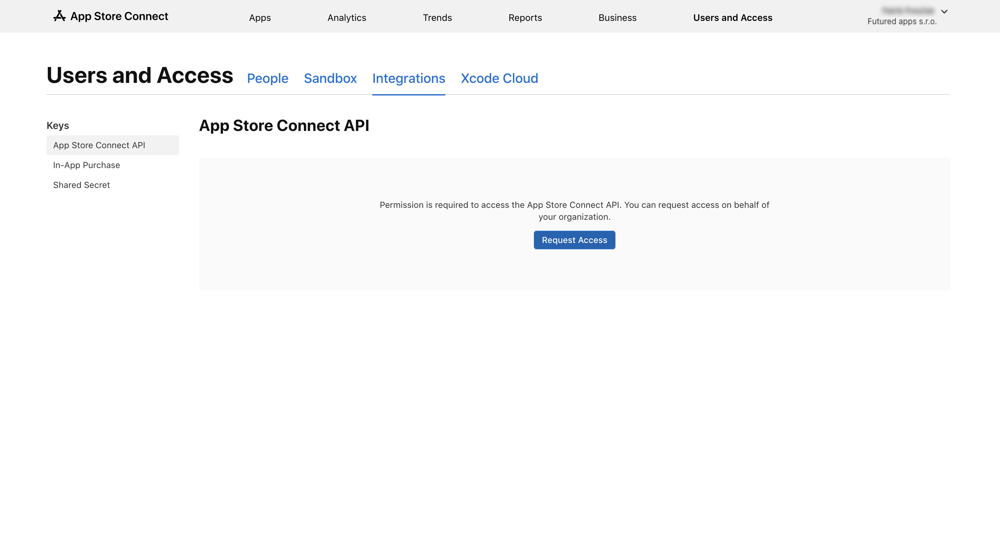
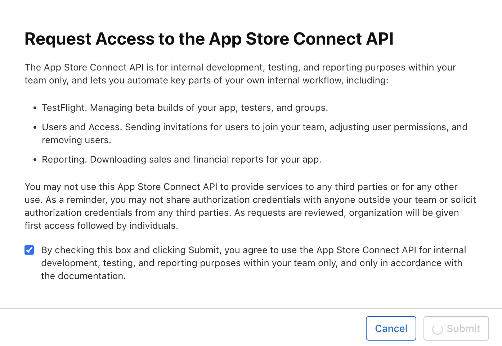

# Customer's account

To establish our CI flow and be able to deliver builds to customer's App Store Connect account and maintain app submission we need:
    
1. add `ops@futured.app` user to customer's App Store Connect account

    ??? note "Steps"
    
        - go to [App Store Connect](https://appstoreconnect.apple.com) and login
        - if your account is in more organizations make sure the correct one is selected
        - select `Users and Access`

            { width="900" }

        - click `+` button

            { width="900" }

        - fill a new user and click `Next` button
            - First Name: `Futured`
            - Last Name: `Operations`
            - Email: `ops@futured.app`
            - Roles: `App Manager`
            - Additional Resources: `Access to Certificates, Identifiers & Profiles.`
            !!! info "User's role"

                We need `App Manager` role to be able to maintain app submission. For more information about App Store Connect roles see [documentation](https://developer.apple.com/help/app-store-connect/reference/role-permissions/).
                
                We also need access to Certificates, Identifiers & Profiles to be able to properly setup out CI flow via Fastlane. For more information about Fastlane see [documentation](https://docs.fastlane.tools/).

            { width="500" }

        - select desired app (if created) or keep selection blank and click `Invite` button

            === "The app is created already"

                { width="500" }

            === "The app is not created yet"

                { width="500" }
        
        - accept the invitation, you can find credentials in Futured's Bitwarden account (if you don't see it there please contact some senior developer)
        
        ??? tip "Fastlane errors troubleshooting"

            **Multiple App Store Connect teams found, please enter the number of the team you want to use:**

            If you don't see newly added organization for `ops@futured.app`

            1. click `ops@futured.app` user in `User and Access` tab
            2. in `Additional Resources` section, deselect `Access to Certificates, Identifiers & Profiles.` and click `Save` button
            3. select `Access to Certificates, Identifiers & Profiles.` and click `Save` again

2. create App Store Connect API key

    !!! note "Steps"
    
        - go to [App Store Connect](https://appstoreconnect.apple.com) and login
        - if your account is in more organizations make sure the correct one is selected
        - select `Users and Access`

            { width="900" }
            
        - select:
        
            { width="900" }
            
            ??? info "First App Store Connect API usage"
            
                In case you haven't granted App Store Connect API permission yet:
        
                - click `Request Access` button
        
                { width="900" }
            
                - check the checkbox and click `Submit` button 
            
                { width="500" }
        
            1. `Integrations`
            2. `App Store Connect API`
            3. `Team Keys`
            4. copy `Issuer ID` and save it to company's Bitwarden (see for example `Futured App Store Connect API Key` entry, don't forget to select `iOS` and `Operations` collections)
            5. click `+` button, fill key name (there's no naming convention), `App Manager` access role and click `Generate` button
            
                { width="500" }
                
                !!! info "Access"

                    We need `App Manager` access to be able to maintain app submission. For more information about App Store Connect roles see [documentation](https://developer.apple.com/help/app-store-connect/reference/role-permissions/).
                
                    We also need access to Certificates, Identifiers & Profiles to be able to properly setup out CI flow via Fastlane. For more information about Fastlane see [documentation](https://docs.fastlane.tools/).
            
            6. new key will appear in the list, please copy `KEY ID` and save it to company's Bitwarden (to the same entry as in step `d.`)
            7. key is downloadable only once, please download it and save it to company's Bitwarden (to the same entry as in step `d.`)
            
                { width="500" }
                
        - add customer's App Store Connect API key to project's repo secrets
        
            - go to your project GitHub repo

                { width="900" }
            
                1. open `Settings` (you need repo admin role to see `Settings` option)
                2. select `Secrets and variables` section and `Actions` subsection
                3. click `New repository secret` button
            
            - add following secrets (keep naming!):
                - `APP_STORE_CONNECT_API_KEY_ISSUER_ID_CUSTOMER` = `Issuer ID`
                - `APP_STORE_CONNECT_API_KEY_KEY_ID_CUSTOMER` = `KEY ID`
                - `APP_STORE_CONNECT_API_KEY_KEY_CUSTOMER` = key content
            
            { width="500" }
            
            - result:

            { width="500" }
