# New project

1. Create a new GitHub repository

    ??? note "Steps"
        
        - open [iOS project template](https://github.com/futuredapp/iOS-project-template) and click `Use this template` -> `Create a new repository`

            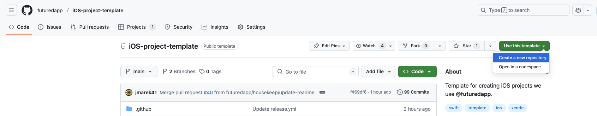{ width="900" }
        
        - fill new repository info
        
            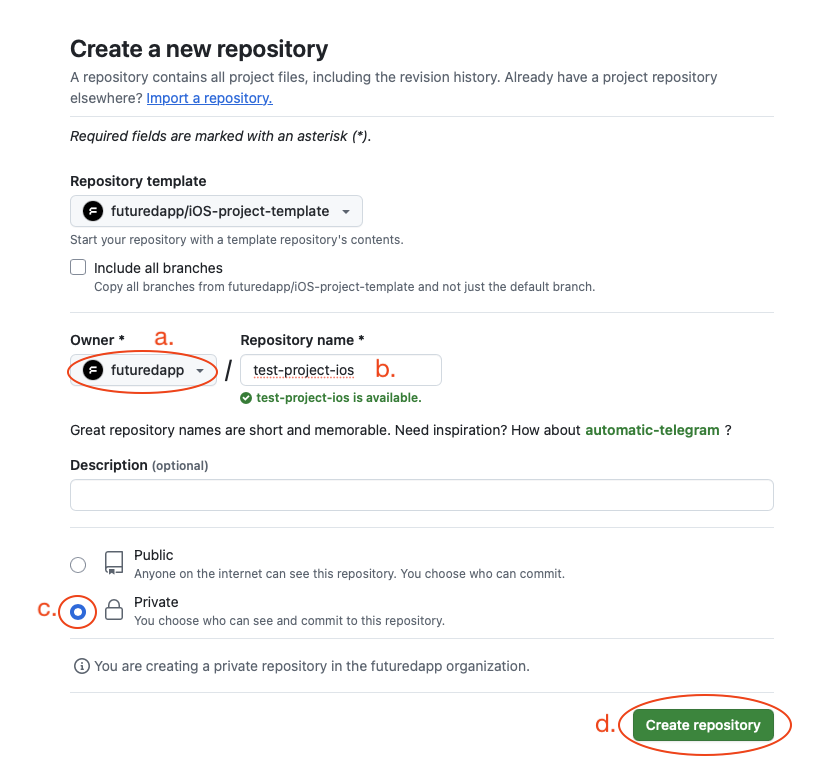{ width="500" }

            1. change owner to `futuredapp`
            2. preffered repo name is *[product-name]-[platform]*, where *[product-name]* includes only name of the product, without client name (like Skoda))
            3. change repo visibility to `private`
            4. click `Create repository` button
        
        - you will be redirected to the new repo in couple of seconds
        - in newly created repo:

            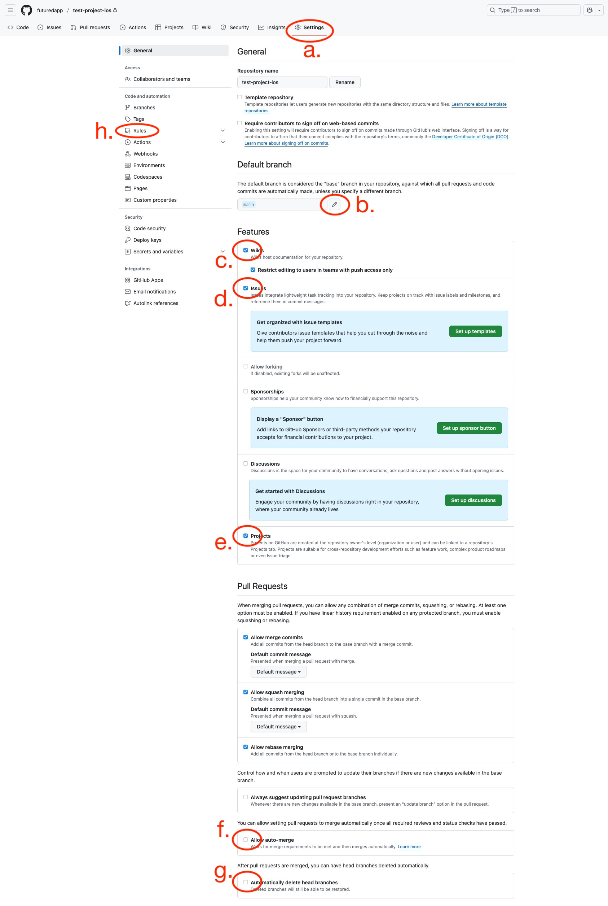{ width="900" }
            
            1. click `Settings` button
            2. edit default branch name -> rename it to `develop`
            
                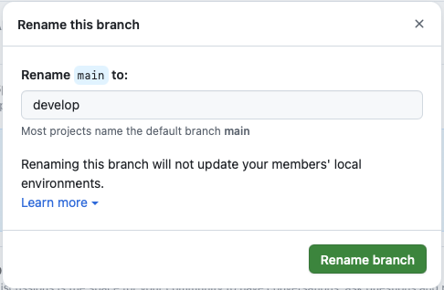{ width="500" }

            3. disable `Wikis` (we do not use it)
            4. disable `Issues` (we do not use it)
            5. disable `Projects` (we do not use it)
            6. enable `Allow auto-merge`
            7. enable `Automatically delete head branches` (there is no need to delete branches manually after each PR merge)
            8. select `Rules` section

                1. select `Rulesets` subsection
                2. click `New ruleset` button
                3. click `New branch ruleset` option from dropdown
            
                    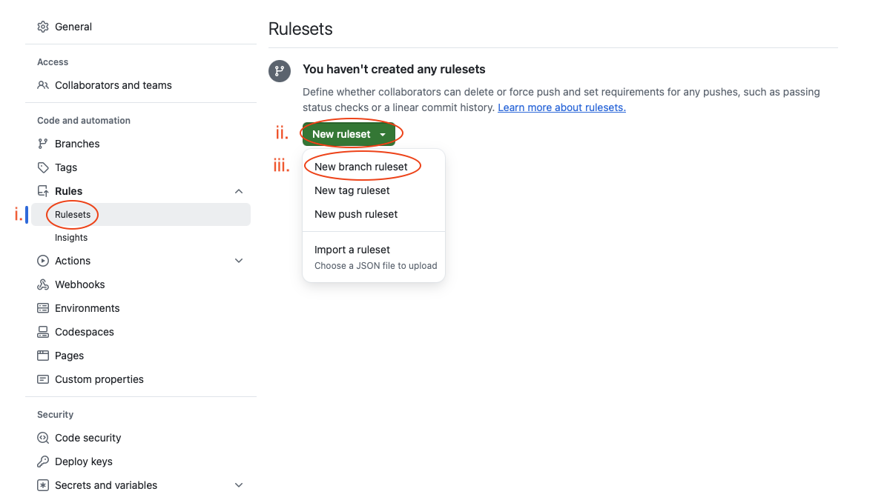{ width="900" }
                    
            9. set new branch ruleset
            
                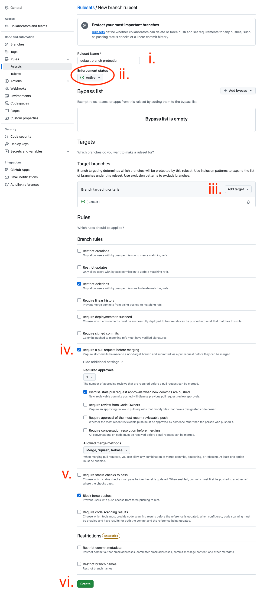{ width="900" }
                
                1. fill `default branch protection` to `Ruleset Name`
                2. change `Enforcement status` to `Active`
                
                    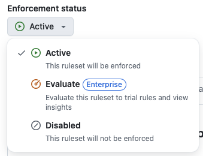{ width="500" }
                    
                3. click `Include default branch` to add default branch as target branch 
                
                    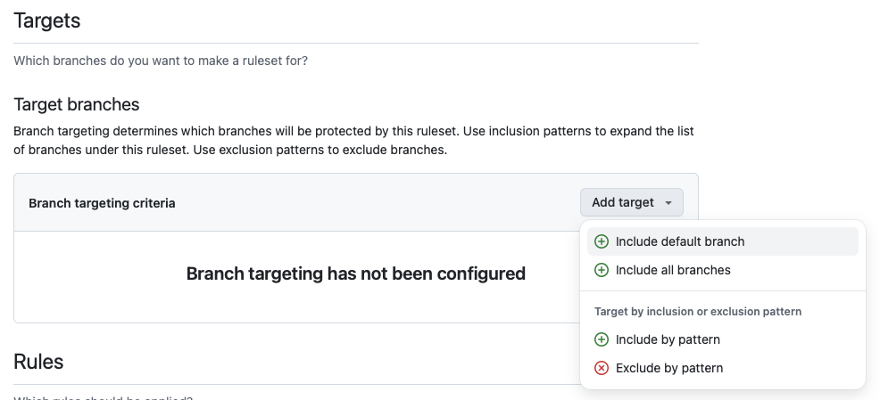{ width="500" }
                    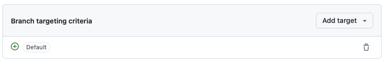{ width="500" }
                    
                4. enable `Require a pull request before merging`
                
                    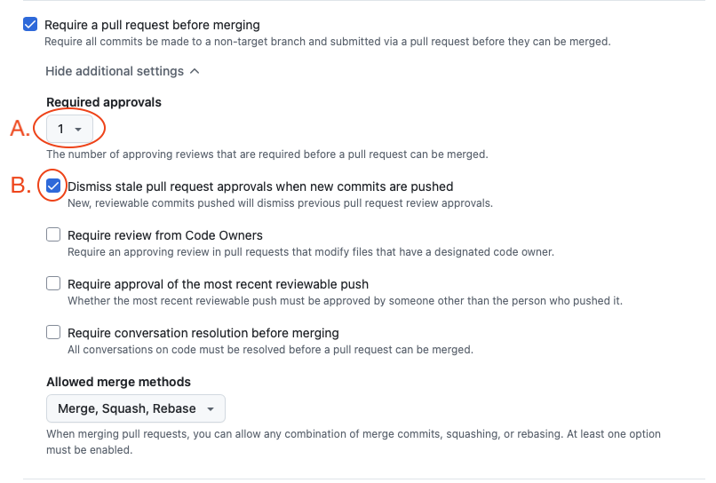{ width="500" }
                
                    1. set `Required approvals` to 1
                    2. enable `Dismiss stale pull request approvals when new commits are pushed`
                    
                5. keep `Require status checks to pass` unchecked for the moment (we'll set it up later)
                    
                    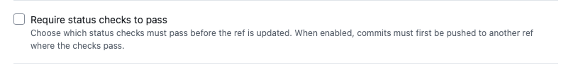{ width="500" }
                    
                6. click `Create` button, new ruleset appears in the list
                
                    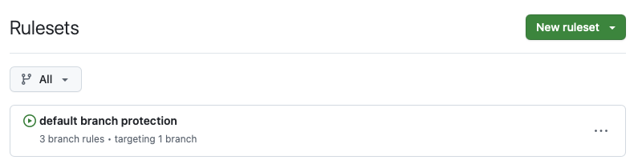{ width="500" }

2. Create a new Xcode project

    - create new branch `feature/PROJ-1-setup-project` where everything will be set up in next steps
    - write product name in CamelCased style. Organization Identifier is *app.futured*. Leave *Use Core Data* unchecked (persistence is usually implemented in much later phase of development) and *Include Tests* checked. (CI requires tests run)
    - change bundle identifier to kebab-cased style `app.futured.kebab-case-app-name`.

3. Configure Ruby environment and Fastlane

    Update your Ruby using your preferred ruby version manager. and install latest version of dependency manager `gem install bundler`.

    - Call `bundle install` to install gems.
    - Edit `fastlane/Fastfile` to specify proper environment variables according to [imported Fastlane README](https://github.com/futuredapp/fastlane).
    - Call `bundle exec fastlane create_apps`. This requires operations rights and you'll need to pass two factor authorization.

4. Add dependencies

    Add following dependecies using Swift Package manager:

    - Open Xcode and add all relevant packages to the project

5. Configure SwiftLint

    - Add a new Run Script Phase that executes the script (remove `swiftlint --fix` if you want to fix linting issues manually):

    ```
    if test -d "/opt/homebrew/bin/"; then
      PATH="/opt/homebrew/bin/:${PATH}"
    fi

    export PATH

    if which swiftlint >/dev/null; then
        swiftlint --fix
        swiftlint
    else
        echo "error: SwiftLint not installed, run: brew install swiftlint"
    fi
    ```

6. Configure the project for Continuous Deployment

    - In Target's Signing & Capabilities tab, uncheck the *Automatically manage signing* checkbox.
    - In Manage Schemes..., set root project scheme as Shared.
    - Run `bundle exec fastlane test` to check whether test can be run on both CI and locally.
    - In Xcode, go to Project Info screen. In Configurations section, add a new configuration by duplicating the **Release** configuration and rename it to **Beta**.
    - On Build Settings tab for target (not project), look for Product Bundle Identifier, expand it to see preferences for Debug, Beta and Release configurations and for the Beta one, add suffix `.beta`.
    - Select appropriate certificates, provisioning profiles for all configurations in the Target's Signing & Capabilities tab.
    - Set proper values in Versioning part of Build Settings:
      - Change Marketing Version to `1.0.0`.
      - Change Current Project Version to `1`.
    - Run `bundle exec fastlane beta` to check whether beta builds to TestFlight succeed.

7. Configure continuous integration

    Choose your CI service, we currently prefer Github Actions.

    ### GitHub Actions

    Most of the configuration is already part of the [iOS project template](https://github.com/futuredapp/iOS-project-template). All the secrets are provided by the organization. If they are not available ask someone with admin permissions to provide them to your repository.

8. Open pull request with the project setup

    - Update CODEOWNERS file.
    - Update project README and fill in all the strike-through points.
    - Commit everything and open PR and add this filled checklist to description.
    - After CI checks the PR, status checks are now available to be added in Branch protections settings. Add them.

9. Enjoy!
