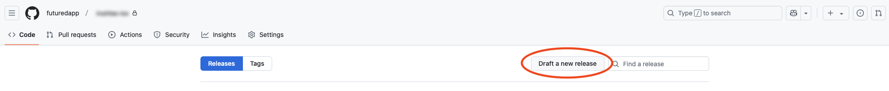
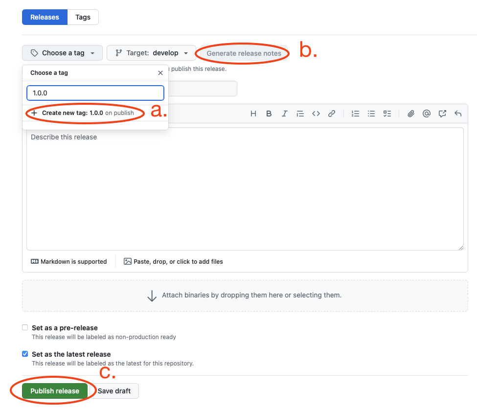
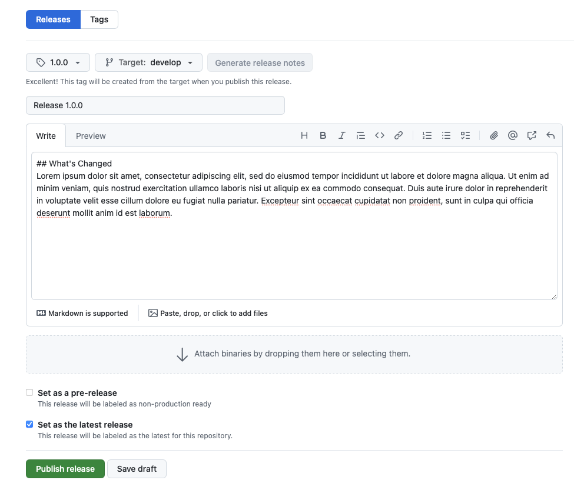

# Release
    
## What to check before every release

- update from previous version (data migration, no unnecessary logouts).
- demo account (will Apple review be able to access most parts of the app if it requires login?)
- release notes (every version should have different release notes)
- visually check screenshots if they are up-to-date

## Source control steps to release

- in GitHub project repo, go to `Code` -> `Releases`
- click `Draft a new release` button

    { width="900" }

- draft a new release from default branch:
    1. create a tag which represents desired version number (don't use any prefix or sufix, keep `x.y.z` format, CI uses it for versioning)
    2. generate release notes
    3. click `Publish release` button
    
    { width="900" }
    { width="900" }
    
- publishing release will automatically run GitHub release action
- when build is processed to App Store Connect, let the tester go through it and ideally go through it yourself too
- only when tester approves the build, proceed with sending the update to the review
