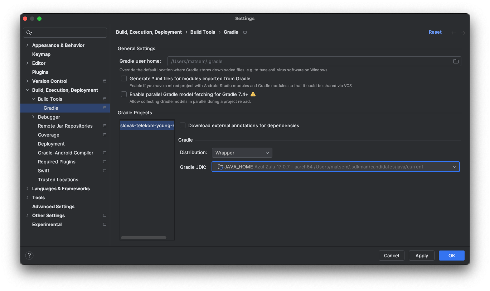
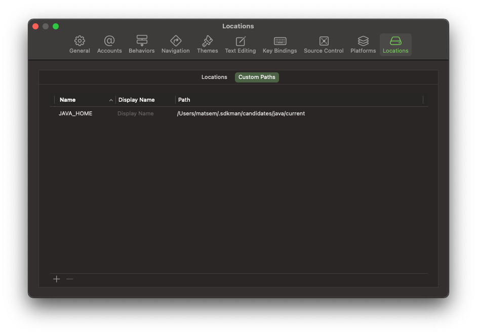
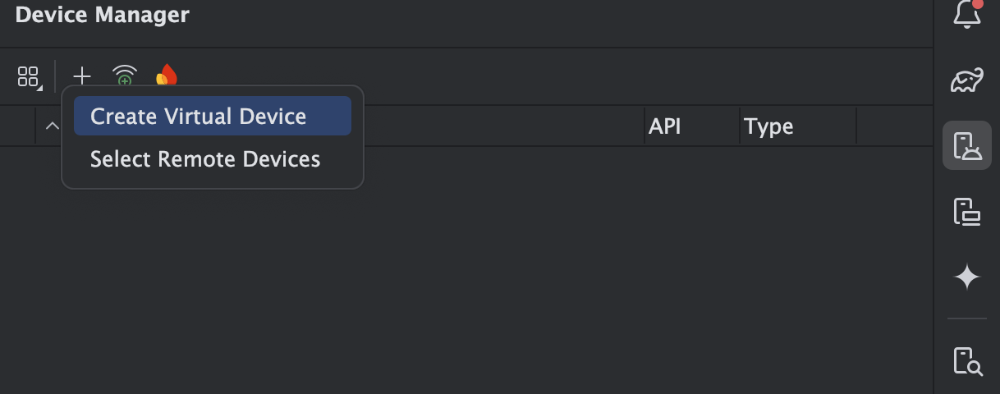
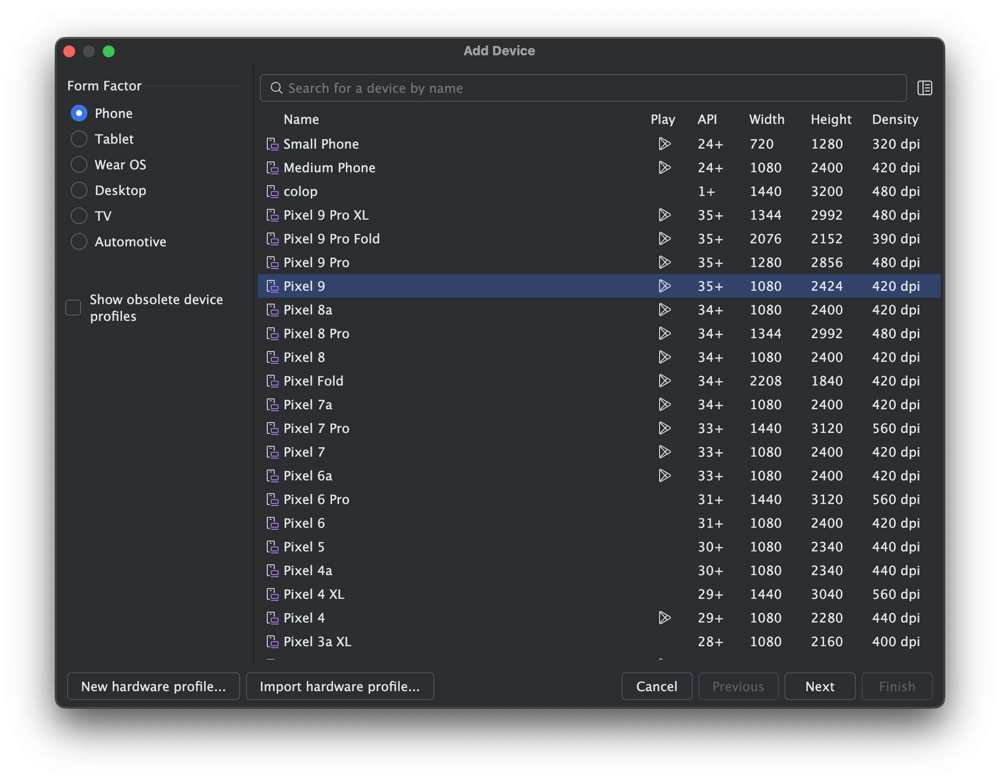
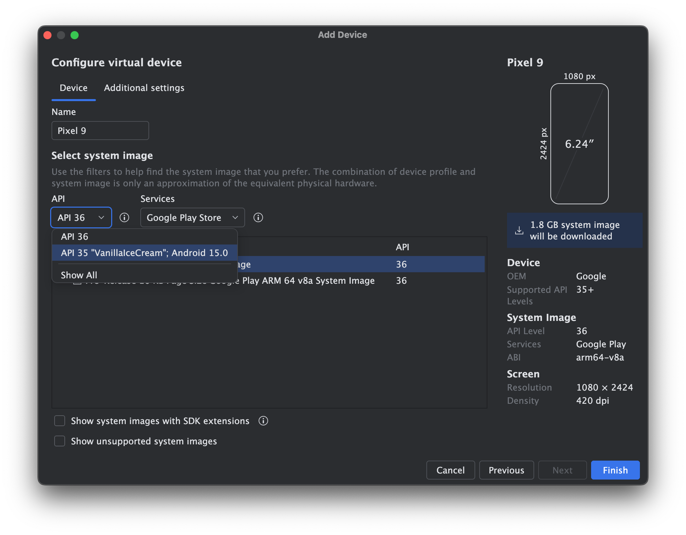
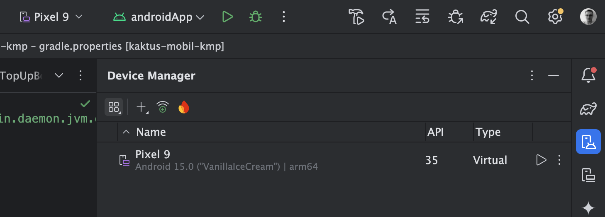
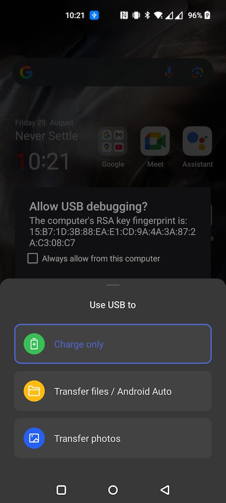
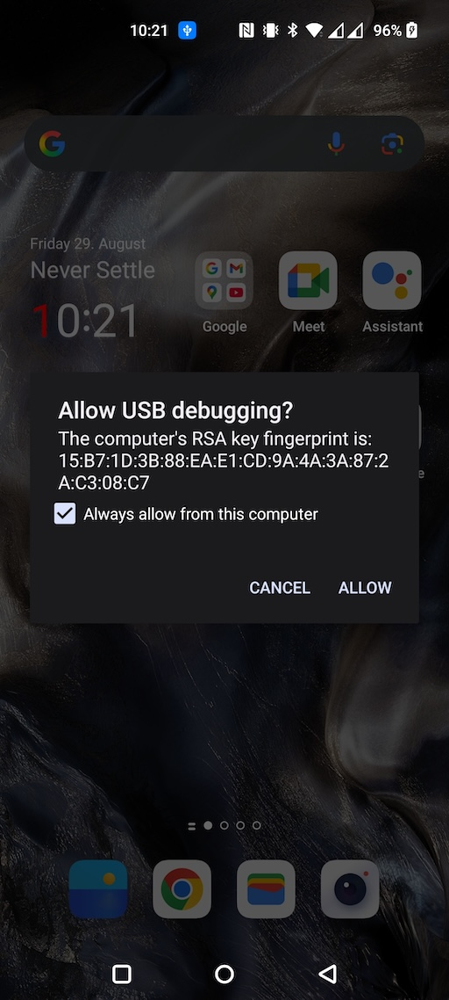

# Local Environment Setup

This guide describes how to set up your development environment for Kotlin Multiplatform (KMP) apps and how to run KMP based app on virtual and physical android device. It is targetted at both Android and iOS developers.

## Prerequisites

- macOS (required to compile iOS)
- JDK 17+
- Android Studio as the Kotlin + Android IDE
- Xcode as the Swift IDE
- (Optional) JetBrains Fleet for IDE users who prefer it

### kdoctor

A quick way to perform a health check of your environment is using `kdoctor`: `https://github.com/Kotlin/kdoctor`.

!!! note
    Not all dependencies checked by `kdoctor` are required for our setup. For instance, we do not use CocoaPods; we use Swift Package Manager instead.

# JDK

JDK is the most important part of the environment. Managing JDK can be tricky, especially if you have multiple distributions installed. Choose one installation method and stick to it.

## Installing JDK

You can install JDK in multiple ways:

- Install with Android Studio (bundled JetBrains Runtime JDK used by default to run Gradle Wrapper)
- Download and install from the web (e.g., `https://www.azul.com/downloads/#downloads-table-zulu` or `https://openjdk.org/`)
- Homebrew: `https://formulae.brew.sh/formula/openjdk`
- SDKMAN!: `https://sdkman.io/`

### Java version

Minumum supported version of JDK is JDK 17 but newer versions up to JDK 24 are also supported. If you don't want to care about the version you are using you can always use JDK which is shipped with Android Studio.

!!! info
    Our CI currently uses Zulu OpenJDK 17: `https://github.com/futuredapp/.github/blob/main/.github/workflows/android-cloud-check.yml`

## JAVA_HOME

Android apps and KMP code are built with [Gradle](https://gradle.org/). The Gradle Wrapper needs JDK, and it looks for it via the `JAVA_HOME` environment variable. This applies to builds started from Android Studio, Xcode, and the terminal. Ideally, all tools (Android Studio, Xcode, terminal) use the same JDK (or at least the same major version).

Refer to: [Java versions in Android builds | Android Studio](https://developer.android.com/build/jdks)

### Terminal

Set `JAVA_HOME` in your shell rc file (`.zshrc`, `.bashrc`, etc.) to point to the JDK you want to use.

- Android Studio has it's JDK always on the same location (on macOS): `/Applications/Android Studio.app/Contents/jbr/Contents/Home/`
- SDKMAN! configures this automatically.
- Homebrew prints post-install instructions.
- Native installers usually register JDKs system-wide.

This enables running Gradle Wrapper tasks from the terminal, which is useful for iOS devs too (e.g., `./gradlew makeSheetHappen` for pulling new strings from Google Sheets).

### Android Studio

Android Studio runs Gradle with the JDK configured at `Settings → Build, Execution, Deployment → Build Tools → Gradle → Gradle JDK`.

- You can use the bundled JetBrains Runtime JDK or select a custom JDK.
- Always verify you are using at least JDK 17.

### Xcode

The build step that compiles the KMP framework in Xcode also uses the Gradle Wrapper. Xcode does not have `JAVA_HOME` set by default, so you may need to set it manually.

- Go to `Settings → Locations → Custom Paths`
- Add `JAVA_HOME` pointing to your JDK path

#### Exception: When you don’t need to set `JAVA_HOME`

If you installed JDK using a native installer, your JDK may be discoverable via `/usr/libexec/java_home`. If `java_home` returns a JDK path, Xcode does not need a Custom Path.

- `java_home` looks for JDKs in `/Library/Java/JavaVirtualMachines`
- More info: `https://github.com/sdkman/sdkman-cli/wiki/FAQ#on-mac-usrlibexecjava_home-does-not-detect-alternatives-installed-by-sdkman-what-can-i-do`

# Running KMP project on Android device

### Emulated device

- Open Android Studio's Device Manager and create a new virtual device.

  {: style="height:auto;width:auto;max-height:300px"}

- Choose a predefined device profile to avoid manual hardware configuration.

  {: style="height:auto;width:auto;max-height:300px"}

- Select a system image with an appropriate API level. For general purposes, use the latest stable version (e.g., API 35 — Android 15).

  {: style="height:auto;width:auto;max-height:300px"}

- Complete the wizard. The emulator will appear in the list of available devices.

  {: style="height:auto;width:auto;max-height:300px"}

### Physical device

To install and run builds directly from Android Studio over USB:

- Enable Developer options on the device.
- In Developer options, enable USB debugging.
- Connect the device via USB and select File transfer (MTP) mode if prompted.

  {: style="height:auto;width:auto;max-height:300px"}

- Accept the RSA fingerprint prompt on the device.

  {: style="height:auto;width:auto;max-height:300px"}

- In Android Studio, select the device as the Run target.

Devices from our test lab are already configured with these settings.

### Developer options and USB debugging

- The exact steps vary by device manufacturer.
- Generally: go to Settings → About phone and tap Build number 7–10 times to enable Developer options.
- Then search for "USB debugging" in Settings and enable it.

#### Quick steps by device/OS

- Pixel / Stock Android (Android 12–15)
    - Settings → About phone → tap "Build number" 7× (enter PIN)
    - Settings → System → Developer options → enable "USB debugging"

- Samsung (One UI)
    - Settings → About phone → Software information → tap "Build number" 7×
    - Settings → Developer options → enable "USB debugging"

- Xiaomi / Redmi / POCO (MIUI / HyperOS)
    - Settings → About phone → tap MIUI version (or HyperOS version or OS Vrsion) 7×
    - Settings → Additional settings → Developer options → enable "USB debugging" and enable "Install via USB"
    - On MIUI/ HyperOS it may be necessery to sign in with xiaomi account and have SIM card present in the phone

- OnePlus (OxygenOS)
    - Settings → About device → Version → tap "Build number" 7×
    - Settings → System settings → Developer options → enable "USB debugging"

- Older Android (8–11) generic
    - Settings → About phone → tap "Build number" 7×
    - Settings → Developer options → enable "USB debugging"

Notes:
- After enabling, connect via USB and accept the RSA fingerprint prompt on device.
- If you don't see Developer options, use the Settings search for "Developer options" or "USB debugging".

# Android Studio

- Install the Kotlin Multiplatform plugin:
  - [Kotlin Multiplatform - IntelliJ IDEs Plugin | Marketplace](https://plugins.jetbrains.com/plugin/14936-kotlin-multiplatform)

!!! tip "JetBrains Toolbox"
    Use JetBrains Toolbox to manage multiple Android Studio and JetBrains IDE versions side-by-side. Helpful for trying nightly/beta builds or when projects require a specific IDE version.

# Xcode

!!! tip "Managing Xcode versions"
    `xcodes` is a CLI tool for installing and managing multiple Xcode versions: `https://github.com/XcodesOrg/xcodes`
