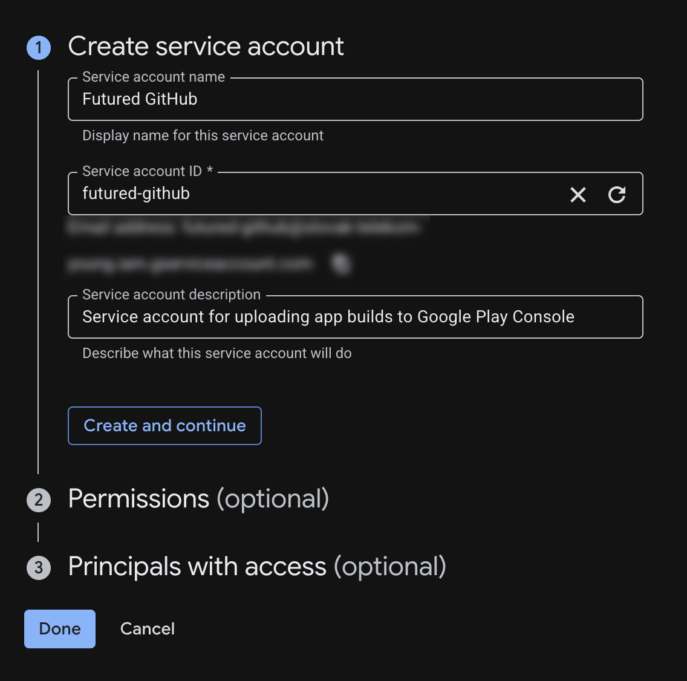

# CI/CD

## Introduction

The release process consists of publishing a new release on GitHub, which triggers a GitHub Actions workflow that uploads a new build to Google Play Console using Google Play Android Developer API.

The workflow file used to run the jobs is implemented in our [shared workflows repo](https://github.com/futuredapp/.github/blob/main/.github/workflows/android-cloud-release-googlePlay.yml).  
A [trigger workflow](https://github.com/futuredapp/kmp-futured-template/blob/develop/.github/workflows/on_release.yml) in your application repo will call this workflow during release.

!!! info "About Permissions"

    If you don't have necessary permissions to perform any of the steps described below, feel free to ask your tech leader for permissions and/or help.

The CI/CD setup requires configuration in three key areas:

1. Google Cloud Platform
2. GitHub Actions
3. Google Play Console

Each component plays a vital role in automating the release process.

## Google Cloud Console

### Prerequisites

There are several prerequisites we need in order to set up the release pipeline:

- Google Play Android Developer API enabled
- Google Cloud service account
- Service account JSON key

We will be working with the Google Cloud project associated with the **production Firebase project**. If Firebase is not integrated, you have two options:

   - Create a new Google Cloud project
   - Work with the client to configure an existing Google Cloud project that you want to use

### Setting Up Google Play Android Developer API

1. In Google Cloud Console, go to the [API Library](https://console.cloud.google.com/apis/library)
2. Enable the [`Google Play Android Developer API`](https://console.cloud.google.com/apis/library/androidpublisher.googleapis.com)

### Creating Service Account

1. In Google Cloud Console, go to [IAM & Admin > Service Accounts](https://console.cloud.google.com/iam-admin/serviceaccounts)
2. Create a new service account with:
      - Service account name: "Futured GitHub"
      - Description: "Service account for uploading app builds from Futured GitHub"
      - No additional permissions needed

        {: style="height:auto;width:auto;max-height:400px"}

### Generating Service Account JSON Key

1. For the service account you just created:
      - Navigate to `Keys` tab
      - Click `Add key > Create new key > JSON`
      - A new JSON key will be generated and automatically downloaded
2. Store the key in **Bitwarden**:
      - Create, or use existing entry for mobile application inside `Android` Collection. Owner should be set to `Futured`.
      - Upload JSON key as attachment
3. Copy content of the JSON file key and store it as `GOOGLE_PLAY_PUBLISH_SERVICE_ACCOUNT` secret inside your GitHub repo
4. Delete the JSON key from your machine (you won't need it anymore)

## Google Play Console

!!! info "B...but, I don't have access to Play Console 🥺"

    Following steps will require Google Play Console admin-level permissions.
    
    - If there's `ops@futured.app` account invited to client's console with necessary permissions, these steps can be done by you and/or somebody who has access to ops account.
    - If not, please work with client to go through these steps.

To enable automated uploads from CI to Google Play Console, we need to grant the service account access to the Play Console. This involves inviting the service account email address (found in the Google Cloud Console) to the Google Play Console with appropriate permissions.

1. In Google Cloud Console:
      - Go to [IAM & Admin > Service Accounts](https://console.cloud.google.com/iam-admin/serviceaccounts)
      - Find email of the service account you created earlier

2. Inside Play Console:
      - Go to `Users and permissions > Invite new users`
      - Fill in Service Account e-mail
      - In `App permissions` tab, select your app and grant following permissions:
          - `View app information (read-only)`
          - `Edit and delete draft apps`
          - `Release apps to testing tracks`
          - `Manage testing tracks and edit tester lists`
      - Click `Invite user`

The service account will automatically accept the invite and should now be visible in `Users and permissions` menu.

## GitHub Actions

In addition to `GOOGLE_PLAY_PUBLISH_SERVICE_ACCOUNT` secret mentioned above, you will need to set up several other secrets required to sign the App Bundle before upload to Play Console. Follow instructions in your project's [release workflow](https://github.com/futuredapp/kmp-futured-template/blob/develop/.github/workflows/on_release.yml) to set up following secrets:

- Upload keystore password
- Upload key alias
- Upload key password
- Google Play Android Developer API service account credentials

## Verification

With this setup, your release pipeline should be up and running. Verify functionality by creating a test release on GitHub.

!!! note "Important Notes"

    Please note that in order to upload a release build from CI, you will be required to:
    
    1. Complete several declarations in Play Console
    2. Have your Privacy Policy URL filled out in Play Console
    
    The first build should be uploaded manually during App Signing setup as described in [Google Play app setup](./10_google_play_app.md#key-management) page.

    If client is not able to provide you with Privacy Policy URL at this stage, use a temporary URL like `https://example.com` to satisfy the Google Play requirements. This is acceptable for internal testing track builds, but remember to update the URL before promoting your app to higher testing tracks.