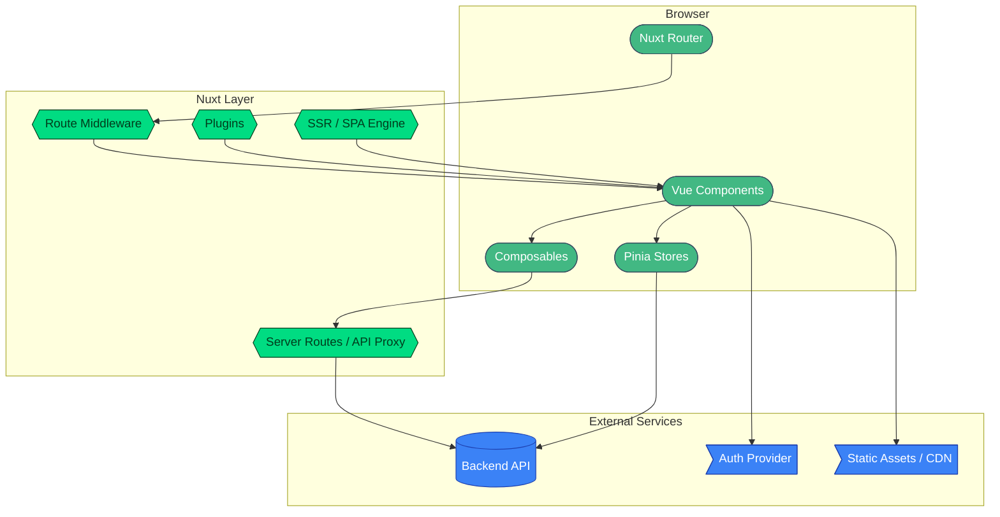
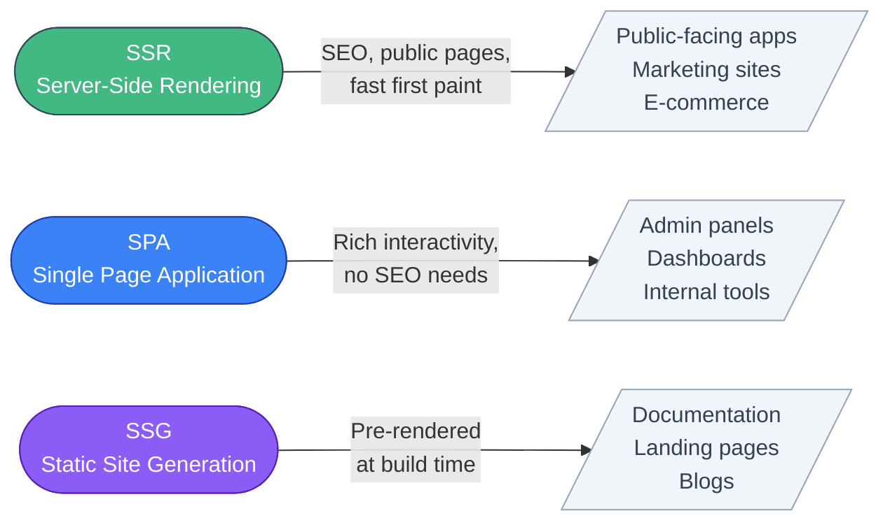
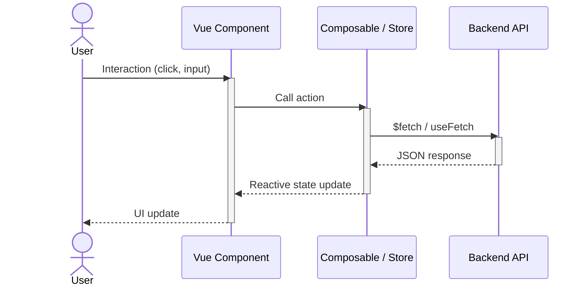

# Frontend

Our frontend stack is built around Vue 3, Nuxt 3, and TypeScript. We prioritize type safety, developer experience, and performance.

## Architecture Overview

<!-- TODO: Replace Mermaid diagram with a custom-designed SVG/image -->


## Core Technologies

### Vue 3 + Composition API

Vue 3 with the Composition API is our primary UI framework. We use `<script setup>` syntax exclusively for new projects, which provides the most concise and type-safe component authoring experience.

```vue
<script setup lang="ts">
import { ref, computed } from 'vue'
import { useUser } from '~/composables/useUser'

interface Props {
    projectId: string
}

const props = defineProps<Props>()

const { user, loading } = useUser()
const greeting = computed(() => `Hello, ${user.value?.name}`)
</script>

<template>
    <div v-if="loading">Loading...</div>
    <h1 v-else>{{ greeting }}</h1>
</template>
```

**Why Vue:**

- Gentle learning curve with progressive adoption
- Excellent TypeScript integration with the Composition API
- Strong ecosystem (Nuxt, Pinia, VueUse, DevTools)
- Performant reactivity system with fine-grained updates
- Active community and long-term maintenance by a dedicated core team

### Nuxt 3

Nuxt 3 is our default framework for Vue applications. It provides a production-ready foundation with conventions that reduce decision fatigue and boilerplate.

<!-- TODO: Replace Mermaid diagram with a custom-designed SVG/image -->


**Key capabilities:**

- **Server-side rendering** — Fast initial page loads and SEO for public-facing apps
- **File-based routing** — Pages are automatically generated from the `pages/` directory
- **Auto-imports** — Vue APIs, composables, and components are available without manual imports
- **Server routes** — Lightweight backend endpoints within the Nuxt app (`server/api/`)
- **Module ecosystem** — Rich set of official and community modules for common needs

**When to use Nuxt:**

- Public-facing applications that benefit from SSR/SEO
- Admin panels and dashboards (using SPA mode)
- Any new Vue project — Nuxt's conventions reduce boilerplate

**When plain Vue (Vite) is sufficient:**

- Embedded widgets or micro-frontends
- Simple single-page apps with no routing needs

### TypeScript

All frontend code is written in TypeScript with strict mode enabled. API types are inferred from the backend via code generation — we don't manually write types for API responses.

**TypeScript benefits in our stack:**

- Catches errors at compile time, before they reach production
- Enables IDE auto-completion and refactoring across the entire codebase
- API types are auto-generated from the backend schema (OpenAPI/GraphQL codegen), ensuring frontend and backend stay in sync
- Types serve as living documentation — when the API changes, the generated types break at compile time, not at runtime

## State Management

### Pinia

Pinia is our state management library. It integrates natively with Vue's reactivity system and supports TypeScript out of the box.

```typescript
// stores/auth.ts
export const useAuthStore = defineStore('auth', () => {
    const user = ref<User | null>(null)
    const isAuthenticated = computed(() => !!user.value)

    async function login(credentials: LoginDto) {
        const response = await $fetch<User>('/api/auth/login', {
            method: 'POST',
            body: credentials,
        })
        user.value = response
    }

    function logout() {
        user.value = null
        navigateTo('/login')
    }

    return { user, isAuthenticated, login, logout }
})
```

**Guidelines:**

- One store per domain concern (auth, users, settings)
- Use composable-style stores (setup function syntax)
- Keep stores thin — business logic belongs in composables or API layers

## Data Flow

<!-- TODO: Replace Mermaid diagram with a custom-designed SVG/image -->


## Build Tooling

### Vite

Vite is the underlying build tool for both Vue and Nuxt projects. It provides:

- **Instant HMR** — Changes reflect in the browser in milliseconds during development
- **Optimized builds** — Tree-shaking, code splitting, and asset optimization for production
- **Plugin ecosystem** — Extensible via Rollup-compatible plugins

### Project Structure

```
project/
├── pages/              # File-based routing
│   ├── index.vue       # → /
│   ├── login.vue       # → /login
│   └── users/
│       ├── index.vue   # → /users
│       └── [id].vue    # → /users/:id
├── components/         # Auto-imported components
│   ├── AppHeader.vue
│   └── UserCard.vue
├── composables/        # Shared reactive logic
│   ├── useAuth.ts
│   └── useUsers.ts
├── stores/             # Pinia state management
│   └── auth.ts
├── layouts/            # Page layouts
│   └── default.vue
├── middleware/          # Route middleware
│   └── auth.ts
├── plugins/            # Nuxt plugins (Sentry, etc.)
├── server/             # Server routes and middleware
│   └── api/
├── types/              # TypeScript type definitions
└── nuxt.config.ts      # Nuxt configuration
```

### Key Conventions

- **Auto-imports**: Nuxt auto-imports Vue APIs and composables — no need for manual imports in most cases
- **CSS**: Use scoped styles in components. For shared styles, use a CSS framework or utility classes as appropriate for the project
- **API calls**: Use Nuxt's `$fetch` or `useFetch` composable for data fetching with built-in SSR support

## Browser Support

We target modern evergreen browsers (Chrome, Firefox, Safari, Edge — latest 2 versions). IE11 is not supported.
