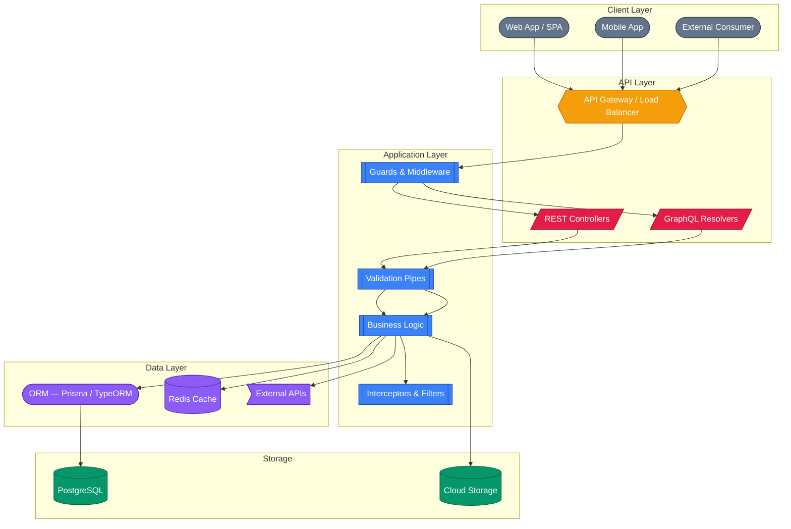
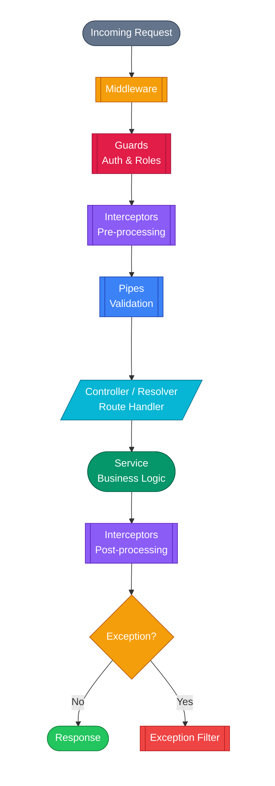
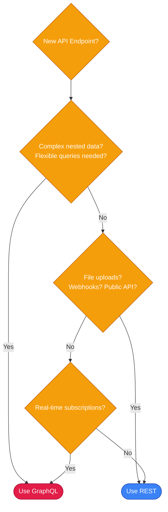

# Backend

Our backend stack is built on NestJS with Node.js, supporting both REST and GraphQL APIs. We emphasize modular architecture, type safety, and testability.

## Architecture Overview

<!-- TODO: Replace Mermaid diagram with a custom-designed SVG/image -->


## Core Technologies

### NestJS

NestJS is our primary backend framework. It provides a structured, opinionated architecture with first-class TypeScript support, dependency injection, and a modular design that scales from small APIs to complex applications.

**Why NestJS:**

- **Modular architecture** — Encourages separation of concerns and code reuse across projects
- **Dependency injection** — Built-in IoC container for clean, testable service composition
- **Protocol agnostic** — Same codebase can serve REST, GraphQL, WebSockets, and gRPC
- **Rich ecosystem** — First-party packages for auth, config, caching, queues, scheduling, and more
- **TypeScript native** — Designed from the ground up for TypeScript, not retrofitted
- **Enterprise-grade** — Battle-tested patterns for validation, error handling, logging, and security

### Request Lifecycle

Every incoming request passes through a well-defined pipeline of NestJS components:

<!-- TODO: Replace Mermaid diagram with a custom-designed SVG/image -->


Each layer has a clear responsibility:

| Layer | Responsibility | Example |
|---|---|---|
| **Middleware** | Request preprocessing | CORS, body parsing, request logging |
| **Guards** | Authentication & authorization | JWT validation, role checks |
| **Interceptors** | Cross-cutting concerns | Response mapping, caching, timing |
| **Pipes** | Data validation & transformation | DTO validation, type coercion |
| **Controllers/Resolvers** | Route handling | Map HTTP/GraphQL requests to services |
| **Services** | Business logic | Core application functionality |
| **Filters** | Error handling | Standardized error responses |

### Module Structure

Every NestJS project follows a modular architecture:

```
src/
├── app.module.ts           # Root module
├── shared/                 # Shared utilities, guards, interceptors
│   ├── guards/
│   ├── interceptors/
│   ├── filters/
│   └── decorators/
├── config/                 # Configuration and validation
├── auth/                   # Authentication module
│   ├── auth.module.ts
│   ├── auth.service.ts
│   ├── auth.controller.ts
│   └── strategies/
├── users/                  # Feature module
│   ├── users.module.ts
│   ├── users.service.ts
│   ├── users.controller.ts (REST) or users.resolver.ts (GraphQL)
│   ├── dto/
│   └── entities/
└── ...
```

**Guidelines:**

- One module per domain entity or feature area
- Modules expose only what's needed via `exports`
- Shared logic goes in `shared/`
- Configuration is validated at startup using `@nestjs/config` with Zod or class-validator

## API Patterns

### REST

For standard CRUD operations and simple APIs, we use REST controllers:

```typescript
@Controller('users')
export class UsersController {
    constructor(private readonly usersService: UsersService) {}

    @Get()
    findAll(@Query() query: PaginationDto): Promise<PaginatedResponse<User>> {
        return this.usersService.findAll(query)
    }

    @Get(':id')
    findOne(@Param('id', ParseUUIDPipe) id: string): Promise<User> {
        return this.usersService.findOne(id)
    }

    @Post()
    create(@Body() dto: CreateUserDto): Promise<User> {
        return this.usersService.create(dto)
    }
}
```

### GraphQL

For complex data requirements or when the frontend needs flexible queries, we use GraphQL with the code-first approach:

```typescript
@Resolver(() => User)
export class UsersResolver {
    constructor(private readonly usersService: UsersService) {}

    @Query(() => [User])
    async users(): Promise<User[]> {
        return this.usersService.findAll()
    }

    @Mutation(() => User)
    async createUser(@Args('input') input: CreateUserInput): Promise<User> {
        return this.usersService.create(input)
    }

    @ResolveField(() => [Project])
    async projects(@Parent() user: User): Promise<Project[]> {
        return this.usersService.getProjects(user.id)
    }
}
```

### Choosing an API Style

<!-- TODO: Replace Mermaid diagram with a custom-designed SVG/image -->


| Use REST when... | Use GraphQL when... |
|---|---|
| Simple CRUD operations | Complex nested data relationships |
| Public APIs for third parties | Frontend needs flexible queries |
| File uploads / downloads | Multiple related entities per request |
| Webhooks and callbacks | Real-time subscriptions needed |

## Validation

All incoming data is validated using DTOs with `class-validator`:

```typescript
// dto/create-user.dto.ts
export class CreateUserDto {
    @IsEmail()
    email: string

    @IsString()
    @MinLength(2)
    @MaxLength(100)
    name: string

    @IsEnum(UserRole)
    role: UserRole
}
```

## Node.js Runtime

- We use the LTS version of Node.js specified in each project's `.nvmrc`
- Package manager: **yarn** (primary) — some projects may use npm
- All projects include `engines` field in `package.json` to enforce Node.js version
