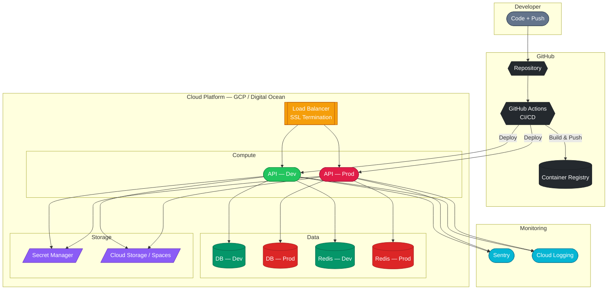
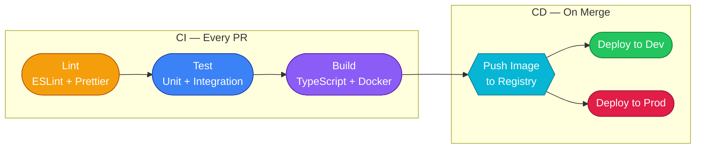
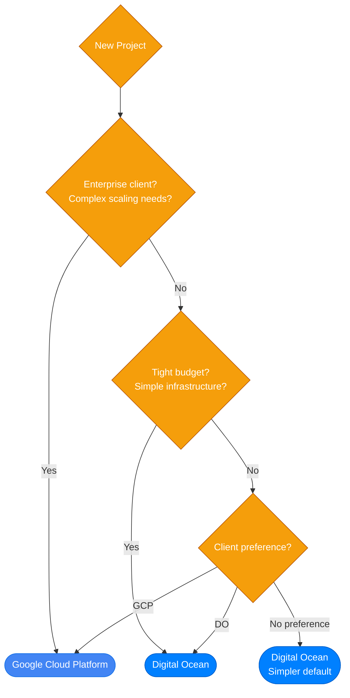
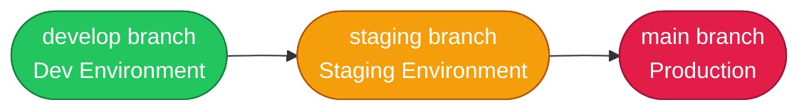

# DevOps & Infrastructure

Our infrastructure is containerized, automated, and deployed via CI/CD pipelines. We run on Google Cloud Platform (GCP) and Digital Ocean, managed with Terraform.

## Infrastructure Overview

<!-- TODO: Replace Mermaid diagram with a custom-designed SVG/image -->


## Docker

Every project is containerized for both development and production.

### Development

We use Docker Compose for local development environments:

```yaml
# docker-compose.dist.yml
services:
  api:
    build:
      context: ./api
      dockerfile: dev.Dockerfile
    volumes:
      - ./api/src:/app/src
    ports:
      - "8080:8080"
    depends_on:
      - postgres
      - cache

  postgres:
    image: postgres:16-alpine
    environment:
      POSTGRES_DB: myapp
      POSTGRES_USER: myapp
      POSTGRES_PASSWORD: localdev
    ports:
      - "5432:5432"
    volumes:
      - pgdata:/var/lib/postgresql/data

  cache:
    image: redis:7-alpine
    ports:
      - "6379:6379"

volumes:
  pgdata:
```

### Production

Production containers use multi-stage builds for minimal image size:

```dockerfile
# Build stage
FROM node:20-alpine AS builder
WORKDIR /app
COPY package*.json ./
RUN npm ci
COPY . .
RUN npm run build

# Production stage
FROM node:20-alpine
WORKDIR /app
COPY --from=builder /app/dist ./dist
COPY --from=builder /app/node_modules ./node_modules
COPY --from=builder /app/package.json ./

EXPOSE 8080
CMD ["node", "dist/main.js"]
```

## CI/CD Pipeline

All projects use GitHub Actions for continuous integration and deployment. The specific workflow varies per project, but the process follows the same stages:

<!-- TODO: Replace Mermaid diagram with a custom-designed SVG/image -->


1. **Lint** — ESLint + Prettier checks ensure code quality
2. **Test** — Unit and integration tests verify functionality
3. **Build** — TypeScript compilation and Docker image build verify everything compiles
4. **Push** — Docker image is tagged with the commit SHA and pushed to the container registry
5. **Deploy** — The new image is deployed to the target environment

See [Deployment Process](../deployment/00_deployment.md) for detailed deployment procedures.

## Hosting Platforms

### Google Cloud Platform (GCP)

Used for larger or more complex projects:

- **Cloud Run** — Serverless container hosting (primary compute)
- **Cloud SQL** — Managed PostgreSQL
- **Cloud Storage** — File storage and static assets
- **Secret Manager** — Secrets management
- **Cloud Build** — Container image builds (alternative to GitHub Actions)

### Digital Ocean

Used for smaller projects or when simpler infrastructure is preferred:

- **App Platform** — Container and static site hosting
- **Managed Database** — PostgreSQL and Redis
- **Spaces** — Object storage (S3-compatible)

### Choosing a Platform

<!-- TODO: Replace Mermaid diagram with a custom-designed SVG/image -->


| | GCP | Digital Ocean |
|---|---|---|
| Best for | Complex apps, scaling needs, enterprise clients | Simpler apps, tighter budgets, quick setup |
| Pricing model | Pay-per-use | Predictable monthly pricing |
| Managed services | Extensive (50+ services) | Focused (core services) |
| Terraform support | Full | Full |

The choice is made per project based on client requirements, budget, and complexity.

## Infrastructure as Code

Some projects use Infrastructure as Code (IaC) to define and manage cloud resources. This is not a default across all projects — it's adopted where the infrastructure complexity justifies it.

- **Terraform** — Currently used on a few projects. Declarative HCL syntax, mature ecosystem, strong GCP and Digital Ocean support.
- **Pulumi** — We are experimenting with Pulumi as an alternative. It allows defining infrastructure in TypeScript, which fits naturally into our stack.

When IaC is used, the general principles apply:

- Infrastructure state is stored remotely (e.g. GCS bucket, Terraform Cloud, Pulumi Cloud)
- Changes go through PR review, just like application code
- Environment-specific configuration is separated from the resource definitions

## Environment Promotion

Code flows through environments in this order:

<!-- TODO: Replace Mermaid diagram with a custom-designed SVG/image -->


Each environment has its own:

- Database instance
- Environment variables and secrets
- Domain / URL
- Resource allocation (dev uses smaller instances)
