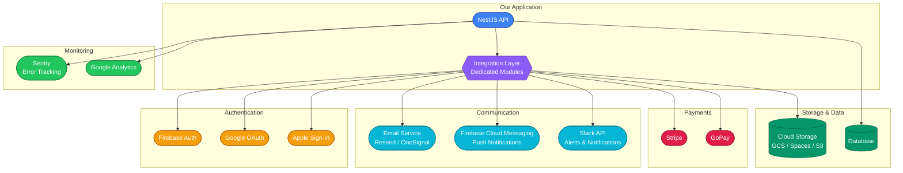
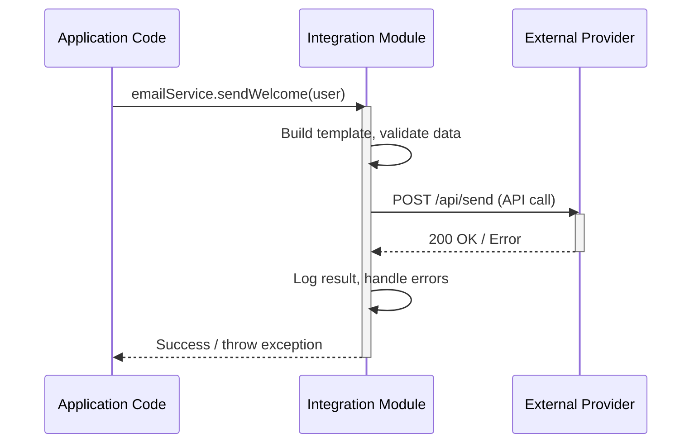
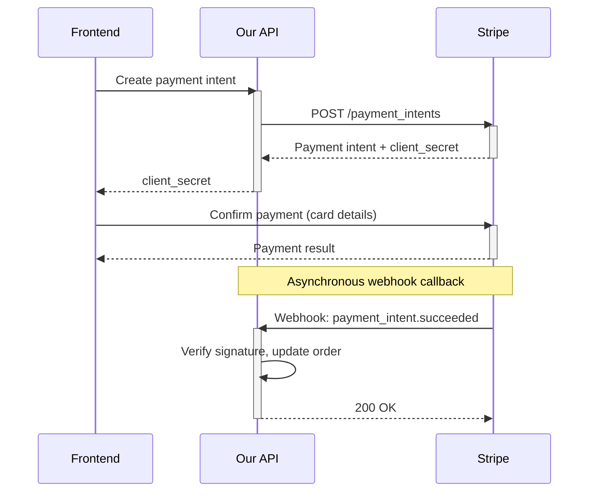

# Third-Party Integrations & APIs

This page documents common third-party services we integrate with and the patterns we follow for clean, maintainable integrations.

## Integration Architecture

<!-- TODO: Replace Mermaid diagram with a custom-designed SVG/image -->


## Integration Patterns

### Wrapping External Services

Always wrap third-party services in a dedicated NestJS module. This isolates external dependencies and makes them easy to swap or mock.

```typescript
// integrations/email/email.module.ts
@Module({
    providers: [EmailService],
    exports: [EmailService],
})
export class EmailModule {}

// integrations/email/email.service.ts
@Injectable()
export class EmailService {
    constructor(private readonly configService: ConfigService) {}

    async sendEmail(to: string, template: string, data: Record<string, unknown>): Promise<void> {
        // Provider-specific implementation
    }
}
```

**Why wrap:**

- Feature modules depend on `EmailService`, not on a specific provider
- Switching from one email provider to another only changes one file
- Easy to mock in tests

### Integration Flow

<!-- TODO: Replace Mermaid diagram with a custom-designed SVG/image -->


### Configuration

All integration credentials are managed as environment variables, never hardcoded:

```typescript
// integrations/storage/storage.service.ts
@Injectable()
export class StorageService {
    private readonly bucket: string

    constructor(private readonly configService: ConfigService) {
        this.bucket = this.configService.getOrThrow<string>('STORAGE_BUCKET')
    }
}
```

## Common Integrations

### Email

- **Resend** — Transactional emails, our primary email provider
- **OneSignal** — Email and push notification platform

Emails are sent via API, not SMTP. We use templates managed in the email provider's dashboard or in-code with MJML/HTML.

### File Storage

- **GCP Cloud Storage** — For GCP-hosted projects
- **Digital Ocean Spaces** — S3-compatible, for DO-hosted projects
- **AWS S3** — When the client's infrastructure is on AWS

```typescript
// Common pattern: generate signed upload URLs
async getUploadUrl(fileName: string): Promise<string> {
    const key = `uploads/${Date.now()}-${fileName}`
    return this.storage.getSignedUrl(key, {
        action: 'write',
        expires: Date.now() + 15 * 60 * 1000, // 15 minutes
        contentType: 'application/octet-stream',
    })
}
```

### Payments

- **Stripe** — Primary payment processor
- **GoPay** — Used for Czech/Slovak market projects

<!-- TODO: Replace Mermaid diagram with a custom-designed SVG/image -->


For payments, we always:

1. Use webhooks to confirm payment status (never trust client-side callbacks alone)
2. Store payment events in our database for auditability
3. Implement idempotency keys for retry safety

### Authentication Providers

- **Google OAuth** — Most common social login
- **Apple Sign-In** — Required for iOS apps with social login
- **Firebase Auth** — Managed authentication for projects that don't need custom auth logic

See [Authentication & Authorization](../security/00_auth.md) for implementation details.

### Analytics & Monitoring

- **Sentry** — Error tracking and performance monitoring (see [Monitoring](../deployment/20_monitoring.md))
- **Google Analytics** — Web analytics (frontend)
- **Mixpanel / PostHog** — Product analytics when needed

### Communication

- **Slack API** — Build notifications, deployment alerts, CI/CD integration
- **Firebase Cloud Messaging (FCM)** — Push notifications for mobile and web apps

## Integration Checklist

When adding a new third-party integration:

- [ ] Create a dedicated module in `src/integrations/<service>/`
- [ ] Add required environment variables to `docker-compose.dist.yml` and `.env.example`
- [ ] Document the integration in the project README
- [ ] Add error handling for API failures (retries, circuit breakers for critical paths)
- [ ] Write integration tests with mocked responses
- [ ] Verify the service has acceptable uptime SLAs for production use
