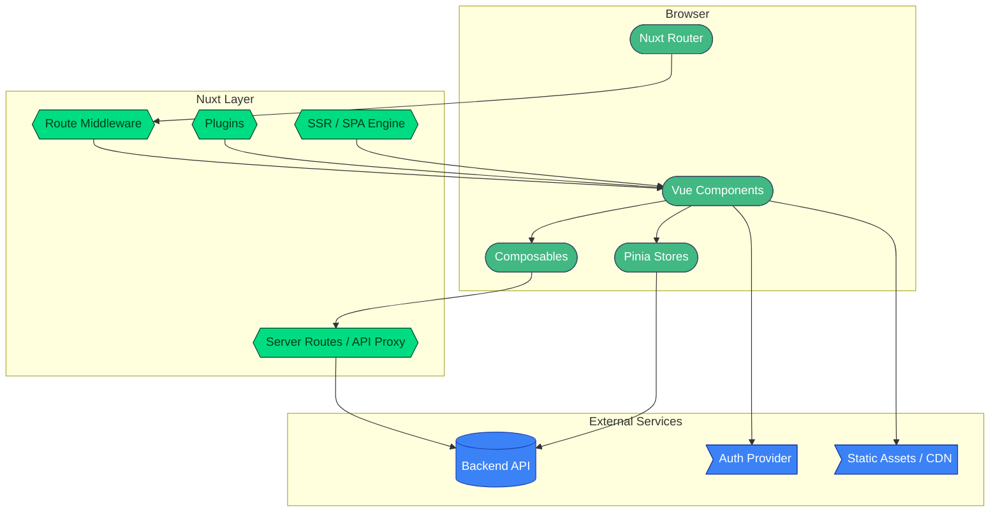

```mermaid
graph TB
    subgraph Browser["Browser"]
        UI([Vue Components])
        Store([Pinia Stores])
        Composables([Composables])
        Router([Nuxt Router])
    end

    subgraph Nuxt["Nuxt Layer"]
        SSR{{SSR / SPA Engine}}
        Middleware{{Route Middleware}}
        Plugins{{Plugins}}
        ServerRoutes{{Server Routes / API Proxy}}
    end

    subgraph External["External Services"]
        API[(Backend API)]
        Auth>Auth Provider]
        CDN>Static Assets / CDN]
    end

    UI --> Store
    UI --> Composables
    Router --> Middleware --> UI
    Plugins --> UI
    SSR --> UI
    Composables --> ServerRoutes
    ServerRoutes --> API
    Store --> API
    UI --> Auth
    UI --> CDN

    classDef browser fill:#42b883,stroke:#35495e,color:#fff
    classDef nuxt fill:#00dc82,stroke:#003c1c,color:#003c1c
    classDef external fill:#3b82f6,stroke:#1e40af,color:#fff

    class UI,Store,Composables,Router browser
    class SSR,Middleware,Plugins,ServerRoutes nuxt
    class API,Auth,CDN external
```