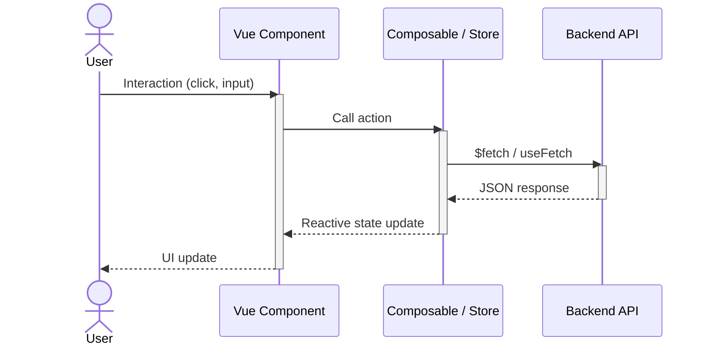

```mermaid
sequenceDiagram
    actor User
    participant Component as Vue Component
    participant Composable as Composable / Store
    participant API as Backend API

    User->>Component: Interaction (click, input)
    activate Component
    Component->>Composable: Call action
    activate Composable
    Composable->>API: $fetch / useFetch
    activate API
    API-->>Composable: JSON response
    deactivate API
    Composable-->>Component: Reactive state update
    deactivate Composable
    Component-->>User: UI update
    deactivate Component
```