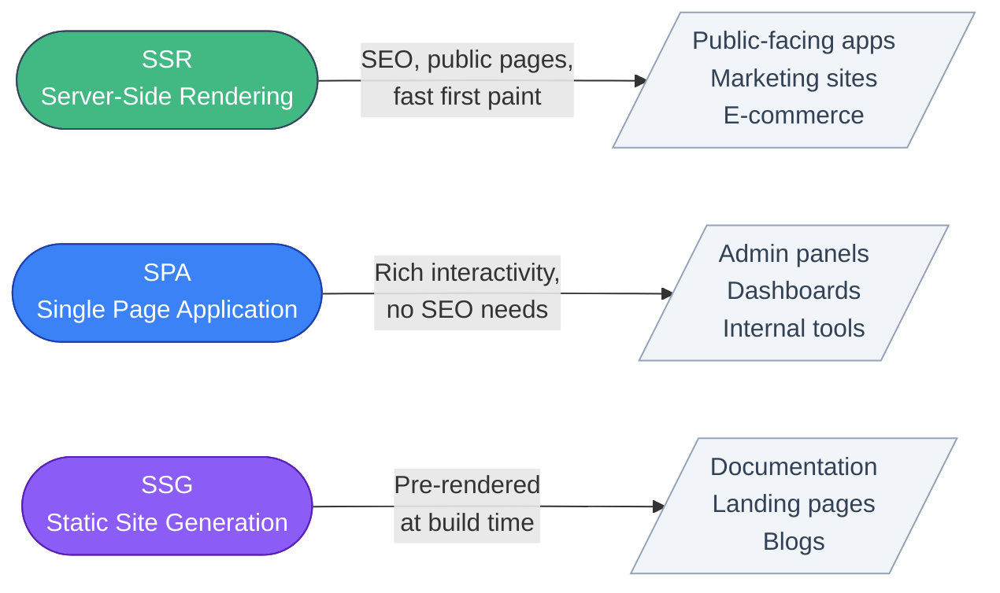

```mermaid
graph LR
    SSR_MODE([SSR<br/>Server-Side Rendering]):::ssr -->|"SEO, public pages,<br/>fast first paint"| USE_SSR[/Public-facing apps<br/>Marketing sites<br/>E-commerce/]:::usecase
    SPA_MODE([SPA<br/>Single Page Application]):::spa -->|"Rich interactivity,<br/>no SEO needs"| USE_SPA[/Admin panels<br/>Dashboards<br/>Internal tools/]:::usecase
    SSG_MODE([SSG<br/>Static Site Generation]):::ssg -->|"Pre-rendered<br/>at build time"| USE_SSG[/Documentation<br/>Landing pages<br/>Blogs/]:::usecase

    classDef ssr fill:#42b883,stroke:#35495e,color:#fff
    classDef spa fill:#3b82f6,stroke:#1e40af,color:#fff
    classDef ssg fill:#8b5cf6,stroke:#5b21b6,color:#fff
    classDef usecase fill:#f1f5f9,stroke:#94a3b8,color:#334155
```