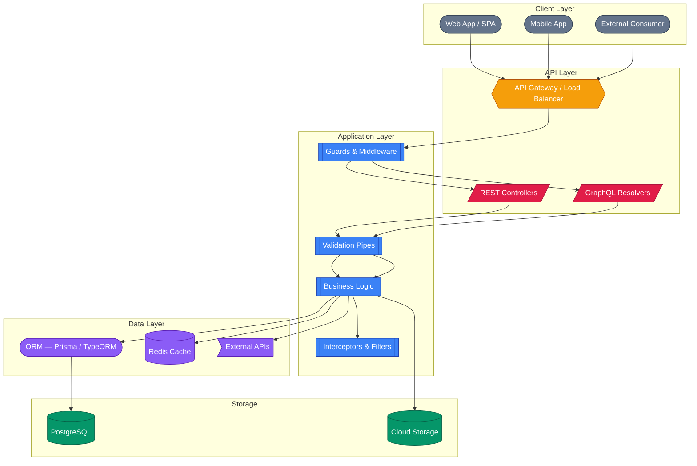

```mermaid
graph TB
    subgraph Clients["Client Layer"]
        Web([Web App / SPA]):::client
        Mobile([Mobile App]):::client
        External([External Consumer]):::client
    end

    subgraph API["API Layer"]
        Gateway{{API Gateway / Load Balancer}}:::gateway
        REST[/REST Controllers/]:::api
        GQL[/GraphQL Resolvers/]:::api
    end

    subgraph App["Application Layer"]
        Guards[[Guards & Middleware]]:::app
        Pipes[[Validation Pipes]]:::app
        Services[[Business Logic]]:::app
        Interceptors[[Interceptors & Filters]]:::app
    end

    subgraph Data["Data Layer"]
        ORM([ORM — Prisma / TypeORM]):::data
        Cache[(Redis Cache)]:::data
        ExtAPI>External APIs]:::data
    end

    subgraph Storage["Storage"]
        DB[(PostgreSQL)]:::storage
        FileStore[(Cloud Storage)]:::storage
    end

    Web --> Gateway
    Mobile --> Gateway
    External --> Gateway
    Gateway --> Guards
    Guards --> REST
    Guards --> GQL
    REST --> Pipes --> Services
    GQL --> Pipes --> Services
    Services --> Interceptors
    Services --> ORM
    Services --> Cache
    Services --> ExtAPI
    ORM --> DB
    Services --> FileStore

    classDef client fill:#64748b,stroke:#334155,color:#fff
    classDef gateway fill:#f59e0b,stroke:#b45309,color:#fff
    classDef api fill:#e11d48,stroke:#9f1239,color:#fff
    classDef app fill:#3b82f6,stroke:#1e40af,color:#fff
    classDef data fill:#8b5cf6,stroke:#5b21b6,color:#fff
    classDef storage fill:#059669,stroke:#065f46,color:#fff
```