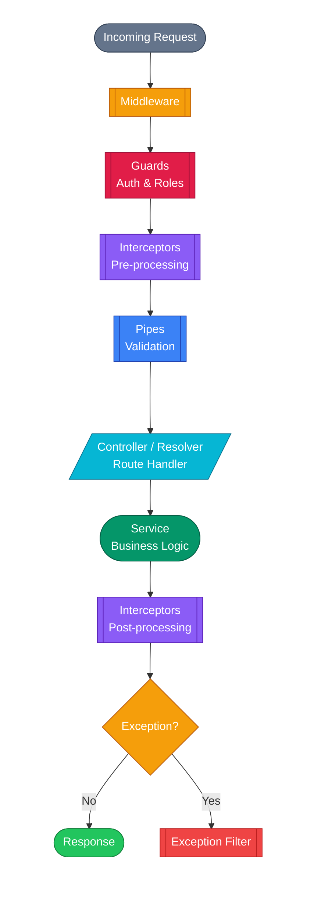

```mermaid
graph TD
    subgraph row1[" "]
        direction LR
        Request([Incoming Request]):::req --> Middleware[[Middleware]]:::mid
        Middleware --> Guards[[Guards<br/>Auth & Roles]]:::guard
        Guards --> Interceptors_Pre[[Interceptors<br/>Pre-processing]]:::inter
        Interceptors_Pre --> Pipes[[Pipes<br/>Validation]]:::pipe
    end

    subgraph row2[" "]
        direction LR
        Handler[/Controller / Resolver<br/>Route Handler/]:::handler --> Service([Service<br/>Business Logic]):::service
        Service --> Interceptors_Post[[Interceptors<br/>Post-processing]]:::inter
        Interceptors_Post --> Filters{Exception?}:::decision
        Filters -->|No| Response([Response]):::success
        Filters -->|Yes| ExFilter[[Exception Filter]]:::error
    end

    Pipes --> Handler

    classDef req fill:#64748b,stroke:#334155,color:#fff
    classDef mid fill:#f59e0b,stroke:#b45309,color:#fff
    classDef guard fill:#e11d48,stroke:#9f1239,color:#fff
    classDef inter fill:#8b5cf6,stroke:#5b21b6,color:#fff
    classDef pipe fill:#3b82f6,stroke:#1e40af,color:#fff
    classDef handler fill:#06b6d4,stroke:#0e7490,color:#fff
    classDef service fill:#059669,stroke:#065f46,color:#fff
    classDef decision fill:#f59e0b,stroke:#b45309,color:#fff
    classDef success fill:#22c55e,stroke:#15803d,color:#fff
    classDef error fill:#ef4444,stroke:#b91c1c,color:#fff

    style row1 fill:none,stroke:none
    style row2 fill:none,stroke:none
```