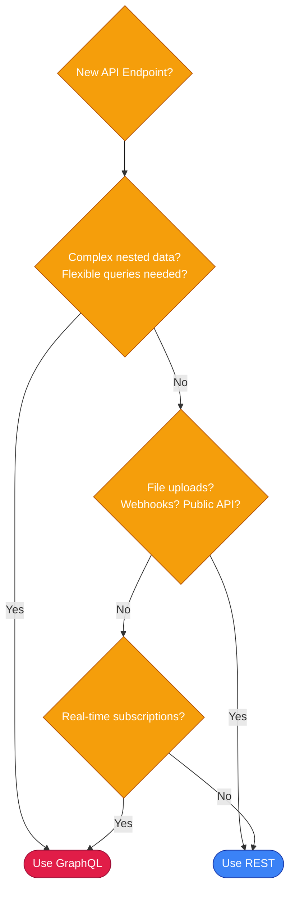

```mermaid
graph TD
    Start{New API Endpoint?}:::decision --> Q1{Complex nested data?<br/>Flexible queries needed?}:::decision
    Q1 -->|Yes| GraphQL([Use GraphQL]):::graphql
    Q1 -->|No| Q2{File uploads?<br/>Webhooks? Public API?}:::decision
    Q2 -->|Yes| REST([Use REST]):::rest
    Q2 -->|No| Q3{Real-time subscriptions?}:::decision
    Q3 -->|Yes| GraphQL
    Q3 -->|No| REST

    classDef decision fill:#f59e0b,stroke:#b45309,color:#fff
    classDef rest fill:#3b82f6,stroke:#1e40af,color:#fff
    classDef graphql fill:#e11d48,stroke:#9f1239,color:#fff
```