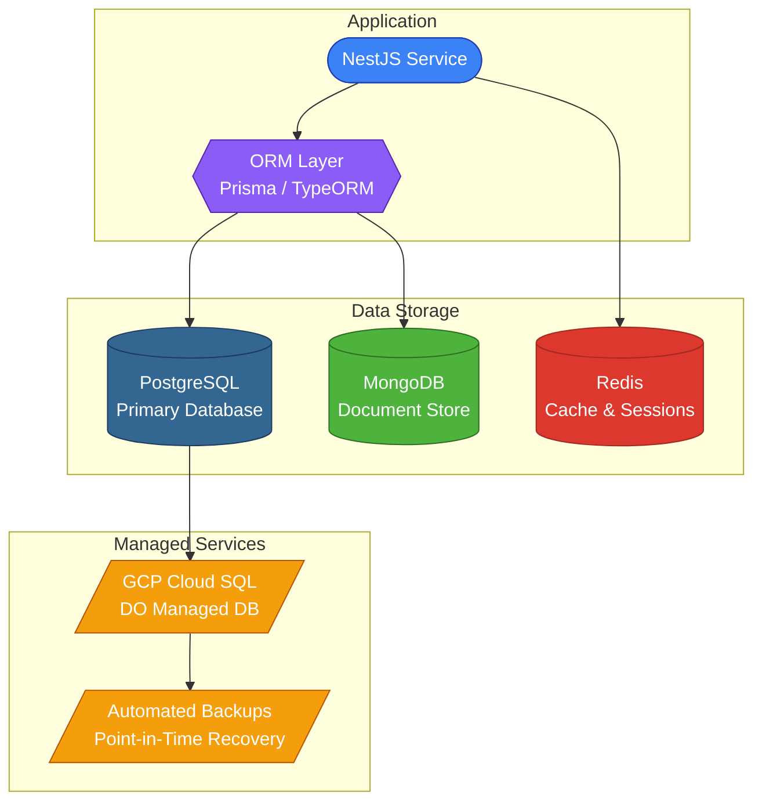

```mermaid
graph TB
    subgraph Application["Application"]
        Service([NestJS Service]):::app
        ORM{{ORM Layer<br/>Prisma / TypeORM}}:::orm
    end

    subgraph DataStorage["Data Storage"]
        PG[(PostgreSQL<br/>Primary Database)]:::pg
        Mongo[(MongoDB<br/>Document Store)]:::mongo
        Redis[(Redis<br/>Cache & Sessions)]:::redis
    end

    subgraph Managed["Managed Services"]
        CloudSQL[/GCP Cloud SQL<br/>DO Managed DB/]:::managed
        Backups[/Automated Backups<br/>Point-in-Time Recovery/]:::managed
    end

    Service --> ORM
    ORM --> PG
    ORM --> Mongo
    Service --> Redis
    PG --> CloudSQL
    CloudSQL --> Backups

    classDef app fill:#3b82f6,stroke:#1e40af,color:#fff
    classDef orm fill:#8b5cf6,stroke:#5b21b6,color:#fff
    classDef pg fill:#336791,stroke:#1e3a5f,color:#fff
    classDef mongo fill:#4db33d,stroke:#2d6e23,color:#fff
    classDef redis fill:#dc382d,stroke:#a02a22,color:#fff
    classDef managed fill:#f59e0b,stroke:#b45309,color:#fff
```