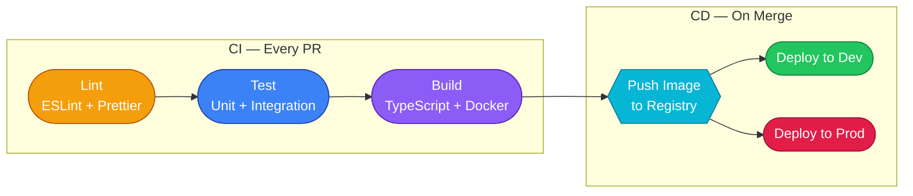

```mermaid
graph LR
    subgraph CI["CI — Every PR"]
        Lint([Lint<br/>ESLint + Prettier]):::lint --> Test([Test<br/>Unit + Integration]):::test
        Test --> Build([Build<br/>TypeScript + Docker]):::build
    end

    subgraph CD["CD — On Merge"]
        Push{{Push Image<br/>to Registry}}:::push --> Deploy_Dev([Deploy to Dev]):::dev
        Push --> Deploy_Prod([Deploy to Prod]):::prod
    end

    Build --> Push

    classDef lint fill:#f59e0b,stroke:#b45309,color:#fff
    classDef test fill:#3b82f6,stroke:#1e40af,color:#fff
    classDef build fill:#8b5cf6,stroke:#5b21b6,color:#fff
    classDef push fill:#06b6d4,stroke:#0e7490,color:#fff
    classDef dev fill:#22c55e,stroke:#15803d,color:#fff
    classDef prod fill:#e11d48,stroke:#9f1239,color:#fff
```