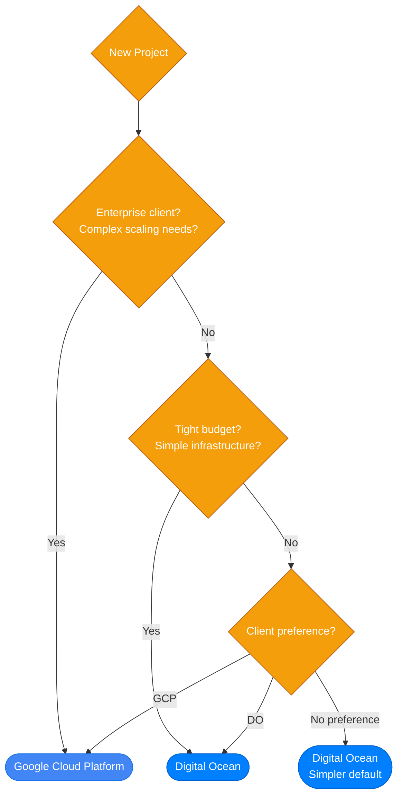

```mermaid
graph TD
    Start{New Project}:::decision --> Q1{Enterprise client?<br/>Complex scaling needs?}:::decision
    Q1 -->|Yes| GCP([Google Cloud Platform]):::gcp
    Q1 -->|No| Q2{Tight budget?<br/>Simple infrastructure?}:::decision
    Q2 -->|Yes| DO([Digital Ocean]):::do
    Q2 -->|No| Q3{Client preference?}:::decision
    Q3 -->|GCP| GCP
    Q3 -->|DO| DO
    Q3 -->|No preference| DO_Default([Digital Ocean<br/>Simpler default]):::do

    classDef decision fill:#f59e0b,stroke:#b45309,color:#fff
    classDef gcp fill:#4285f4,stroke:#1a73e8,color:#fff
    classDef do fill:#0080ff,stroke:#0060cc,color:#fff
```