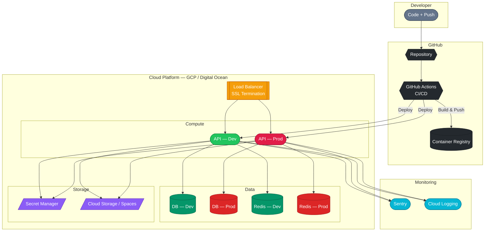

```mermaid
graph TB
    subgraph Dev["Developer"]
        Code([Code + Push]):::dev
    end

    subgraph GH["GitHub"]
        Repo{{Repository}}:::github
        Actions{{GitHub Actions<br/>CI/CD}}:::github
        Registry[(Container Registry)]:::github
    end

    subgraph Cloud["Cloud Platform — GCP / Digital Ocean"]
        LB[[Load Balancer<br/>SSL Termination]]:::infra

        subgraph Compute["Compute"]
            API_Dev([API — Dev]):::compute_dev
            API_Prod([API — Prod]):::compute_prod
        end

        subgraph Data["Data"]
            DB_Dev[(DB — Dev)]:::data_dev
            DB_Prod[(DB — Prod)]:::data_prod
            Cache_Dev[(Redis — Dev)]:::data_dev
            Cache_Prod[(Redis — Prod)]:::data_prod
        end

        subgraph Storage["Storage"]
            Secrets[/Secret Manager/]:::storage
            Files[/Cloud Storage / Spaces/]:::storage
        end
    end

    subgraph Mon["Monitoring"]
        Sentry([Sentry]):::monitoring
        Logs([Cloud Logging]):::monitoring
    end

    Code --> Repo
    Repo --> Actions
    Actions -->|Build & Push| Registry
    Actions -->|Deploy| API_Dev
    Actions -->|Deploy| API_Prod
    LB --> API_Dev
    LB --> API_Prod
    API_Dev --> DB_Dev
    API_Dev --> Cache_Dev
    API_Prod --> DB_Prod
    API_Prod --> Cache_Prod
    API_Dev --> Secrets
    API_Prod --> Secrets
    API_Dev --> Files
    API_Prod --> Files
    API_Dev --> Sentry
    API_Prod --> Sentry
    API_Dev --> Logs
    API_Prod --> Logs

    classDef dev fill:#64748b,stroke:#334155,color:#fff
    classDef github fill:#24292e,stroke:#1b1f23,color:#fff
    classDef infra fill:#f59e0b,stroke:#b45309,color:#fff
    classDef compute_dev fill:#22c55e,stroke:#15803d,color:#fff
    classDef compute_prod fill:#e11d48,stroke:#9f1239,color:#fff
    classDef data_dev fill:#059669,stroke:#065f46,color:#fff
    classDef data_prod fill:#dc2626,stroke:#991b1b,color:#fff
    classDef storage fill:#8b5cf6,stroke:#5b21b6,color:#fff
    classDef monitoring fill:#06b6d4,stroke:#0e7490,color:#fff
```