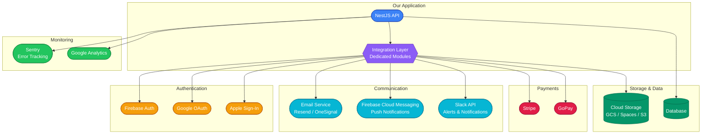

```mermaid
graph TB
    subgraph App["Our Application"]
        API([NestJS API]):::app
        IntLayer{{Integration Layer<br/>Dedicated Modules}}:::integration
    end

    subgraph Auth["Authentication"]
        Firebase([Firebase Auth]):::auth
        Google([Google OAuth]):::auth
        Apple([Apple Sign-In]):::auth
    end

    subgraph Comms["Communication"]
        Email([Email Service<br/>Resend / OneSignal]):::comms
        FCM([Firebase Cloud Messaging<br/>Push Notifications]):::comms
        Slack([Slack API<br/>Alerts & Notifications]):::comms
    end

    subgraph Store["Storage & Data"]
        CloudStorage[(Cloud Storage<br/>GCS / Spaces / S3)]:::storage
        DB[(Database)]:::storage
    end

    subgraph Pay["Payments"]
        Stripe([Stripe]):::payments
        GoPay([GoPay]):::payments
    end

    subgraph Mon["Monitoring"]
        Sentry([Sentry<br/>Error Tracking]):::monitoring
        Analytics([Google Analytics]):::monitoring
    end

    API --> IntLayer
    IntLayer --> Firebase
    IntLayer --> Google
    IntLayer --> Apple
    IntLayer --> Email
    IntLayer --> FCM
    IntLayer --> Slack
    IntLayer --> CloudStorage
    IntLayer --> Stripe
    IntLayer --> GoPay
    API --> Sentry
    API --> Analytics
    API --> DB

    classDef app fill:#3b82f6,stroke:#1e40af,color:#fff
    classDef integration fill:#8b5cf6,stroke:#5b21b6,color:#fff
    classDef auth fill:#f59e0b,stroke:#b45309,color:#fff
    classDef comms fill:#06b6d4,stroke:#0e7490,color:#fff
    classDef storage fill:#059669,stroke:#065f46,color:#fff
    classDef payments fill:#e11d48,stroke:#9f1239,color:#fff
    classDef monitoring fill:#22c55e,stroke:#15803d,color:#fff
```