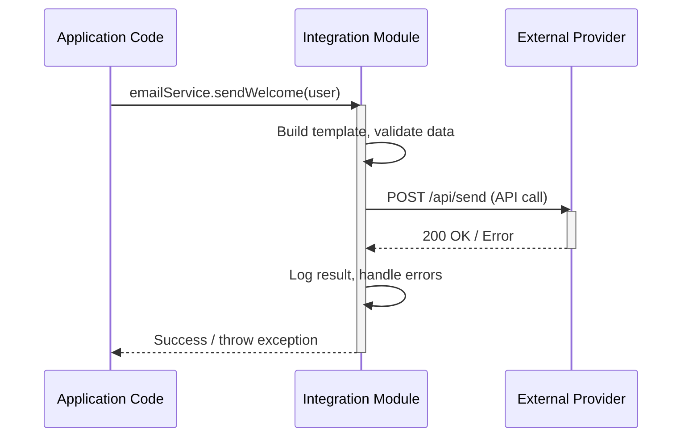

```mermaid
sequenceDiagram
    participant App as Application Code
    participant Module as Integration Module
    participant Provider as External Provider

    App->>Module: emailService.sendWelcome(user)
    activate Module
    Module->>Module: Build template, validate data
    Module->>Provider: POST /api/send (API call)
    activate Provider
    Provider-->>Module: 200 OK / Error
    deactivate Provider
    Module->>Module: Log result, handle errors
    Module-->>App: Success / throw exception
    deactivate Module
```