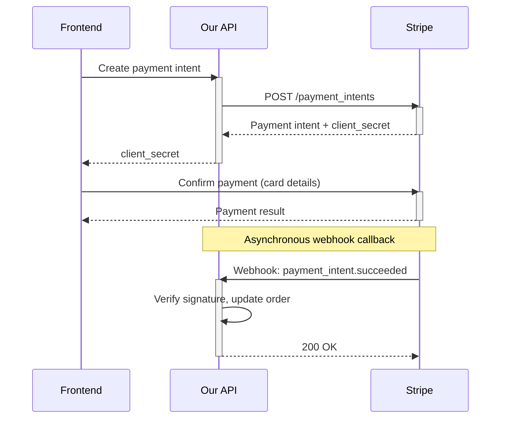

```mermaid
sequenceDiagram
    participant Client as Frontend
    participant API as Our API
    participant Stripe as Stripe

    Client->>API: Create payment intent
    activate API
    API->>Stripe: POST /payment_intents
    activate Stripe
    Stripe-->>API: Payment intent + client_secret
    deactivate Stripe
    API-->>Client: client_secret
    deactivate API

    Client->>Stripe: Confirm payment (card details)
    activate Stripe
    Stripe-->>Client: Payment result
    deactivate Stripe

    Note over Stripe,API: Asynchronous webhook callback
    Stripe->>API: Webhook: payment_intent.succeeded
    activate API
    API->>API: Verify signature, update order
    API-->>Stripe: 200 OK
    deactivate API
```