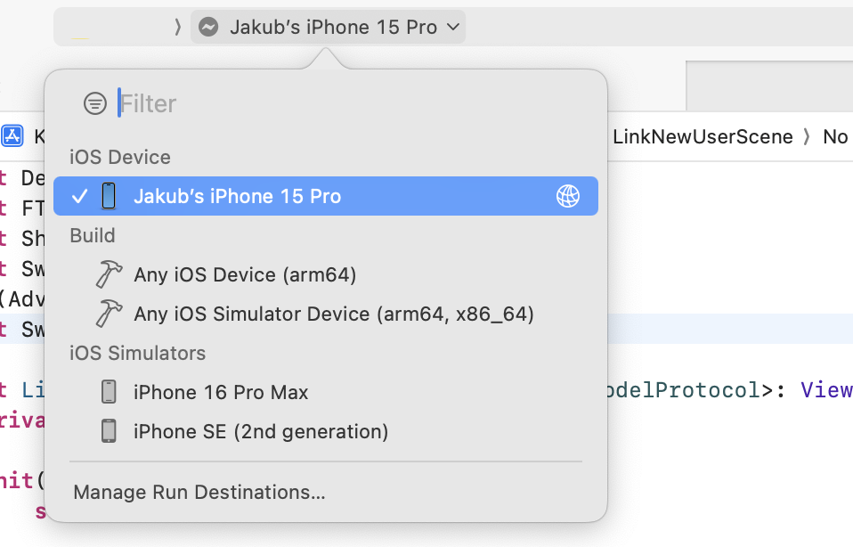
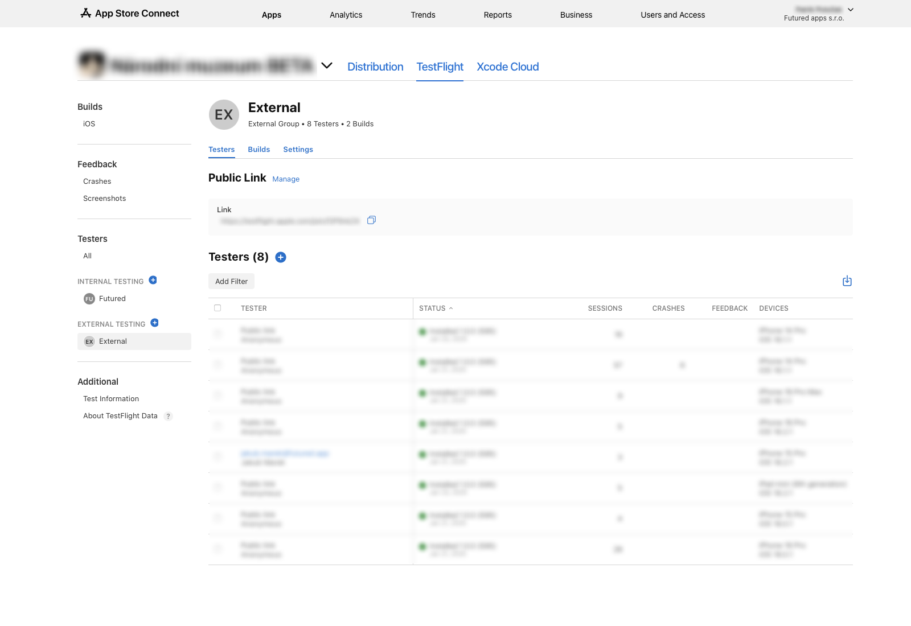

# Builds

There are three build configurations.
    
## Debug builds

Debug builds are created in Xcode by developers.

### How to run a debug build on device

1. Environment setup - follow this well-written and maintained manual: 

    - [The fastest and easiest way to install Ruby on a Mac](https://www.moncefbelyamani.com/how-to-install-xcode-homebrew-git-rvm-ruby-on-mac/)

2. From Terminal in the project folder:

    - install necessary ruby tools:
        ```bash
        bundle install
        ```

    - download development certificate and provisioning profiles:
        ```bash
        bundle exec fastlane provisioning
        ```
        you may be asked to provide *match password*, please use `Fastlane Match password` entry from Futured's Bitwarden

3. Build using Xcode, select your device in run destinations

    { width="900" }

??? info "Haven't you registered your iOS device yet? Follow these instructions."
    ## Adding to list of devices
    
    ### Get your device's UDID
    
    1. Connect your device to Mac and unlock it
    2. Open Finder
    
        1. Select your device in Locations
        2. In detail, click the grey metadata under your device name until you see UDID section
        
        { width="900" }
    
    ### Register your device
    
    To be able to run a debug build on your device you need to add it to the company's private fastlane repository. Update file `device-list.txt` file. See closed PRs for inspiration or follow these steps:

    Each device has to have three columns **separated by tabs**.

    1. Device UDID
    2. Descriptive name of the device
    3. Operation system

    `UDID	Owner - Device model	ios/mac`

    ### Regenerating the profiles for new devices

    Project profiles won't regenerate automatically after adding a new device. To regenerate the profiles, follow these steps:

    1. Retrieve the ops Apple ID password from Bitwarden
    2. Ask someone with ops access to provide you with an authentication code
    3. In the project directory, call the following command from Terminal:
        ```bash
        MATCH_FORCE=true bundle exec fastlane update_provisioning
        ```

        _If `MATCH_FORCE` environment variable is not provided the profiles are updated only when invalid._

## Beta builds

Beta builds are mainly used by our QA team. There's possibility to add beta build to external testing and share it via link or email invitation if needed (see attached screenshot). External beta build has to go through app review. It can take longer for the first build or after some longer period without uploading a new build but it's usually approved immediately. Always send tested builds to external testing!

Although it is possible to invite external users to Futured's App Store Connect and add them to internal testing we prefer external testing for the following reasons:

- internal builds are automatically submited with merged pull request => these builds should be tested first which cannot be guaranteed in internal testing
- security concerns

{ width="900" }

## Production builds

Production builds can be either distributed via Futured's or customer's App Store Connect account. It is also possible to set up ASC account later and migrate the app (see [docs](https://developer.apple.com/help/app-store-connect/transfer-an-app/overview-of-app-transfer/)) but we strongly recommend to make a decesion before releasing the first version.

!!! info "First submission requirements"

    See the [First Submission Requirements](ios_app_store_checklist.md) for a complete list of requirements for the first App Store submission.

[**How to build a production build**](ios_release.md/#source-control-steps-to-release)
