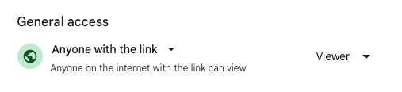
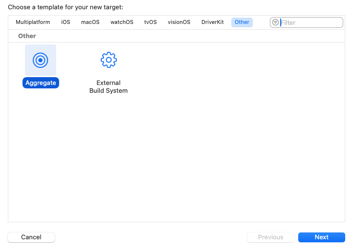
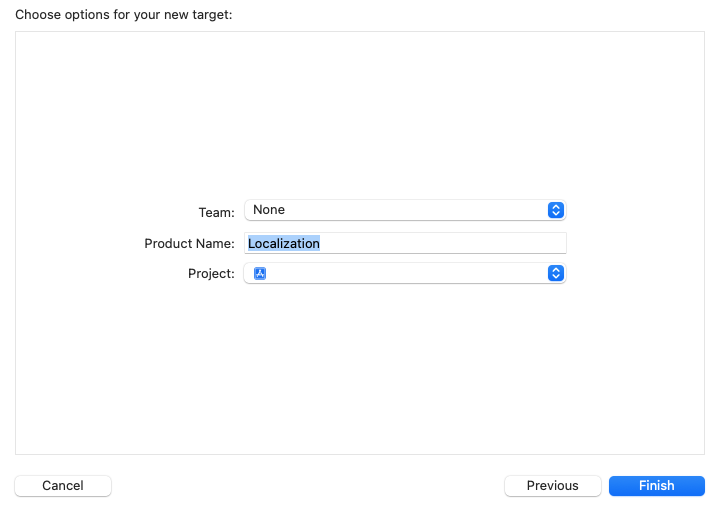
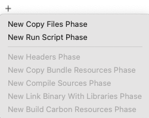
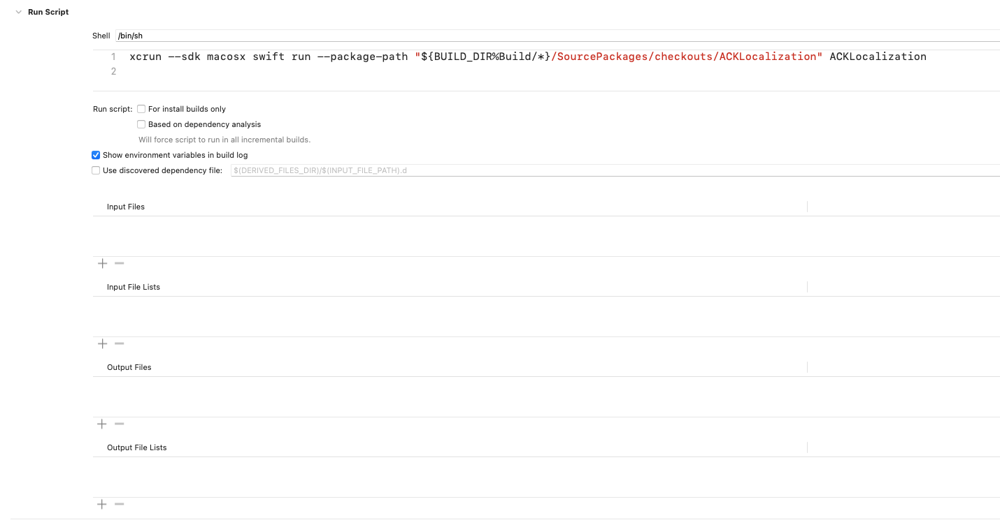

# Localization

For localization, we use a shared Google Docs spreadsheet and the ACKLocalization library to download the strings into the project.

## How to setup localization

1. Create a copy of the [following template](https://docs.google.com/spreadsheets/d/1uFh2CNb159lITG74LyQGBLvgcwlHzr1xjb_T5zx0Xaw) and move it to your project folder [here](https://drive.google.com/drive/folders/0B0wtxTvgka10ejNvaGk3WTBtNDg)
    - you need to be a member of Futured to access the second link
    - if you don't see the project folder, create it
    - please use lowerCamelCase for iOS keys to make searching within the project easier
    
2. Set the sharing permissions to *Anyone on the internet with this link can view*

    { width="500" }
    
3. Set up the integration into the project
    - add the [ACKLocalization](https://github.com/AckeeCZ/ACKLocalization) library via SPM
    - add a `localization.json` file to the project's root:

        ```json

        {
            "destinationDir": "{project_folder}/Resources/Localization",
            "keyColumnName": "key_ios",
            "languageMapping": {
    	        "EN": "en",
                "CS": "cs",
                "SK": "sk"
            },
            "apiKey": "{spreadsheet_api_key}",
            "spreadsheetID": "{spreadsheet_id}",
            "stringsFileName": "Localizable.strings",
            "spreadsheetTabName": "Translations"
        }

        ```

        `spreadsheet_api_key` - you will find it in Futured's Bitwarden under *Spreadsheet localizer service account* entry

        `spreadsheet_id` - copy it from your spreadsheet's URL
    
        { width="900" }
    
4. In your Xcode project:
    - create a new *Aggregate target*  for downloading the strings and name it `Localization`
    
        { width="900" }
        { width="900" }

    - in its Build Phases, add a New Run Script Phase
    
        { width="250" }
    
    - paste the path to the library and uncheck the `Based on dependency analysis` checkbox
    
    
        For standart project:
        ```bash

        xcrun --sdk macosx swift run --package-path "${BUILD_DIR%Build/*}/SourcePackages/checkouts/ACKLocalization" ACKLocalization

        ```
        
        For localization in local Swift package:
        ```bash

        xcrun --sdk macosx swift run --package-path "$SRCROOT/{package_folder}" ACKLocalization

        ```
        `packages_folder` - the path to your local Swift packages folder
        
    
        { width="900" }


    - run the Localization target 
        - you should see the new localization files upon successful completion
        
    - kudos to our colleagues from Ackee 🖤
