# New Project

1. Create a new GitHub repository

    ??? note "Steps"
        
        - open [iOS project template](https://github.com/futuredapp/iOS-project-template) and click `Use this template` -> `Create a new repository`

            { width="900" }
        
        - fill new repository info
        
            { width="500" }

            1. change owner to `futuredapp`
            2. preffered repo name is *[product-name]-[platform]*, where *[product-name]* includes only name of the product, without client name (like Skoda))
            3. change repo visibility to `private`
            4. click `Create repository` button
        
        - you will be redirected to the new repo in couple of seconds
        - in newly created repo:

            { width="900" }
            
            1. click `Settings` button
            2. edit default branch name -> rename it to `develop`
            
                { width="500" }

            3. disable `Wikis` (we do not use it)
            4. disable `Issues` (we do not use it)
            5. disable `Projects` (we do not use it)
            6. enable `Allow auto-merge`
            7. enable `Automatically delete head branches` (there is no need to delete branches manually after each PR merge)
            8. select `Rules` section

                1. select `Rulesets` subsection
                2. click `New ruleset` button
                3. click `New branch ruleset` option from dropdown
            
                    { width="900" }
                    
            9. set new branch ruleset
            
                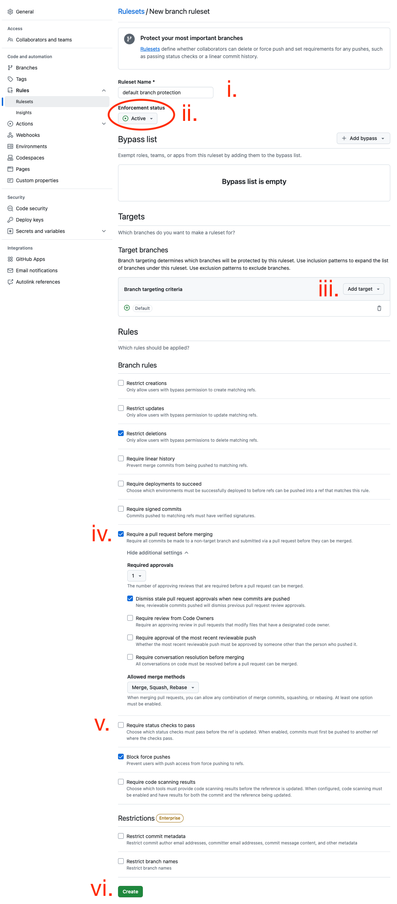{ width="900" }
                
                1. fill `default branch protection` to `Ruleset Name`
                2. change `Enforcement status` to `Active`
                
                    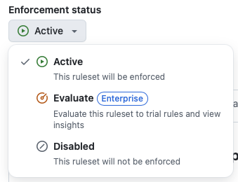{ width="500" }
                    
                3. click `Include default branch` to add default branch as target branch 
                
                    { width="500" }
                    { width="500" }
                    
                4. enable `Require a pull request before merging`
                
                    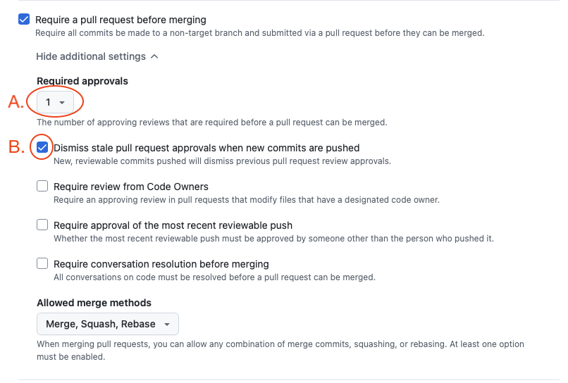{ width="500" }
                
                    1. set `Required approvals` to 1
                    2. enable `Dismiss stale pull request approvals when new commits are pushed`
                    
                5. keep `Require status checks to pass` unchecked for the moment (we'll set it up later)
                
                    - don't forget to add the `test` action rule after opening your first PR (actions will appear in the list after their first run)
                    
                    { width="500" }
                    
                6. click `Create` button, new ruleset appears in the list
                
                    { width="500" }
                    
2. Configure Ruby environment and Fastlane

    ??? note "Steps"
    
        - clone your project's repo
        - create a new branch `feature/PROJ-1-Setup-project` where everything will be set up in next steps
        
            - PROJ is your project Jira identificator
            - 1 is Jira task number (if you don't have Jira yet ask your PM)
    
        - if you haven't setup ruby on your machine yet
        
            - follow manual steps of [this](https://www.moncefbelyamani.com/how-to-install-xcode-homebrew-git-rvm-ruby-on-mac/) tutorial
            - install bundler from Terminal with `gem install bundler`
            
        - in project folder

            - edit `fastlane/Fastfile` to specify environment variables
            
        - in Terminal

            - switch to repo root folder
            - call `bundle install` to install gems
           
3. Create app in Apple Developer and App Store Connect portals

   ??? note "Steps"
       
            - create app in Apple Developer and App Store Connect portals
            
                !!! warning "App Store Connect 2FA"
                
                    If you need a 2FA code for `ops@futured.app` account when running the following Fastlane commands, please contact someone from the iOS team for assistance.

                ??? info "App released from customer's ASC account"
                
                    If you filled customer's environment variables in Fastfile
                    
                    - call `bundle exec fastlane create_apps`
                    
                        - if it's the first app for the account append `company_name:"My Company Inc"` parameter
                        
                    - call `bundle exec fastlane update_provisioning include_release:true create_branch:true`
                    
                        - `create_branch:true` parameter is needed only for the first time to create customer branch in our [Apple certificates repo](https://github.com/futuredapp/apple-certificates) 
                    
                ??? info "App released from Futured's ASC account"
                
                    - call `bundle exec fastlane create_apps`
                    - call `bundle exec fastlane update_provisioning include_release:true`
                    
                ??? info "The app's release account is currently unknown"
                
                    You can setup release account later
                
                    - call `bundle exec fastlane create_apps skip_release_app:true`
                    - call `bundle exec fastlane update_provisioning`
                    
                    Once you're familiar with the release process, rerun the above command (no need to worry about duplication)

4. Create a new Xcode project

    ??? note "Steps"

        - install `FuturedArchitecture` project template (if you haven’t done so yet)
        
            - paste the following script to Terminal and press enter
            ```bash
            bash << 'EOF'
            #!/bin/bash

            echo "Cloning repository..."
            git clone --depth=1 git@github.com:futuredapp/FuturedKit.git

            echo "Running make..."
            (cd FuturedKit/Templates && make)

            echo "Cleaning up..."
            rm -rf FuturedKit

            echo "Done!"
            EOF
            ```
        
        - open Xcode (or close and open again for refresh templates) and select`File` -> `New` -> `Project`
        
            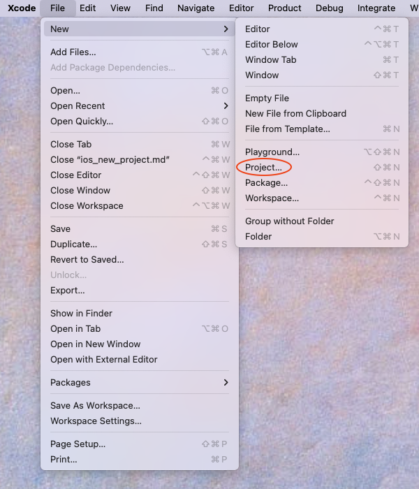{ width="500" }
            
        - select `iOS` tab and `SwiftUI App` from `FuturedArchitecture` and click `Next` button
        
            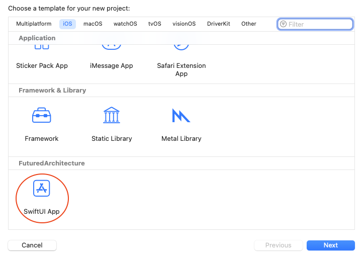{ width="500" }
            
        - fill the project info and click `Next` button

            - write product name in CamelCased style
            - organization identifier is `app.futured`
            - leave *Include Tests* checked (CI requires tests run)
            
            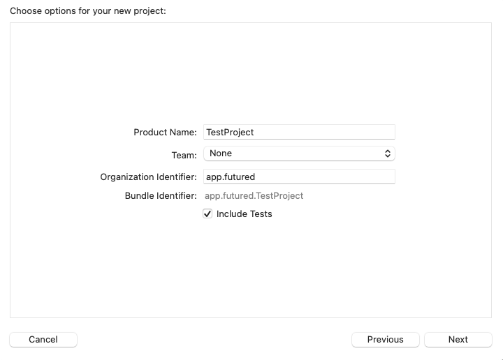{ width="500" }
            
        - choose your repo folder and click `Create` button

            - Xcode project will open
            - close it and check the project's folder
            - move content of `{ProjectName}` folder to the repo root (you need to rename it first to be able to move the content)
            - delete `{ProjectName}` folder
            - open Xcode project again
            
            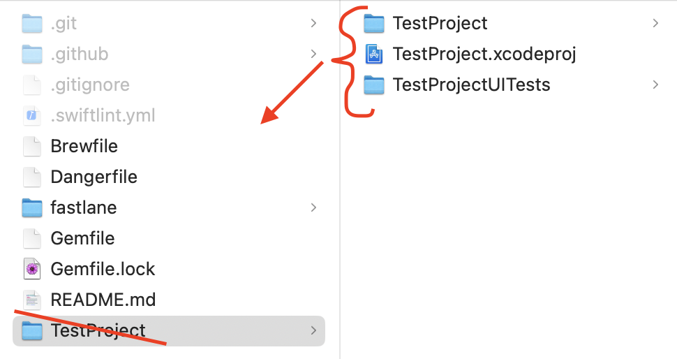{ width="500" }

        - in Xcode:
        
            - change bundle identifier to kebab-cased style `app.futured.kebab-case-app-name`

                1. select `root`
                2. select main project target
                3. select `Signing & Capabilities` tab
                4. change bundle id for all configurations
                
                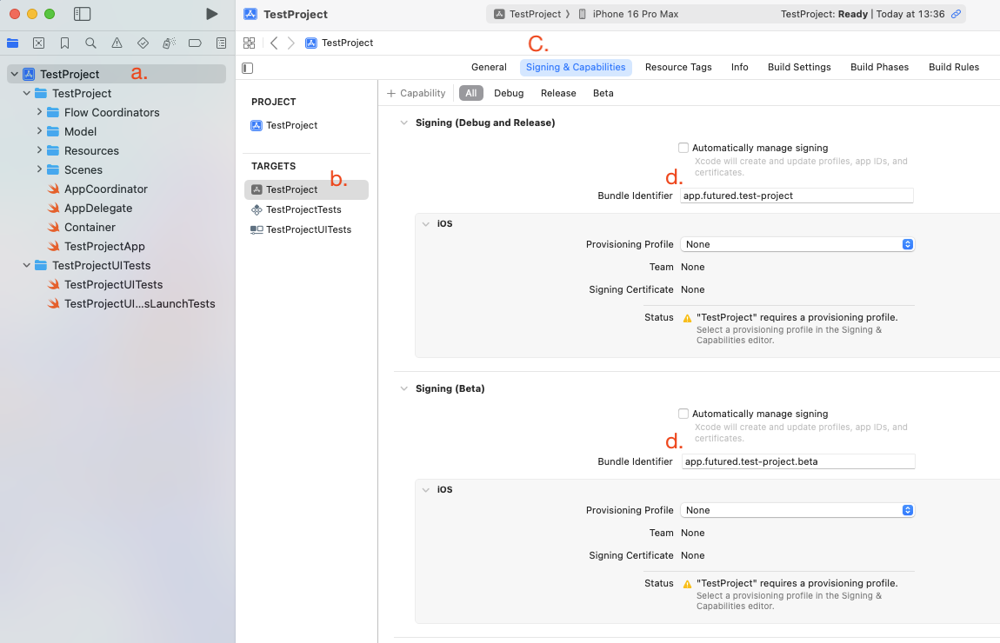{ width="900" }
                
            - setup Futured's architecture
            
                - add `FuturedKit` package dependency - [https://github.com/futuredapp/FuturedKit.git](https://github.com/futuredapp/FuturedKit.git)
                
                    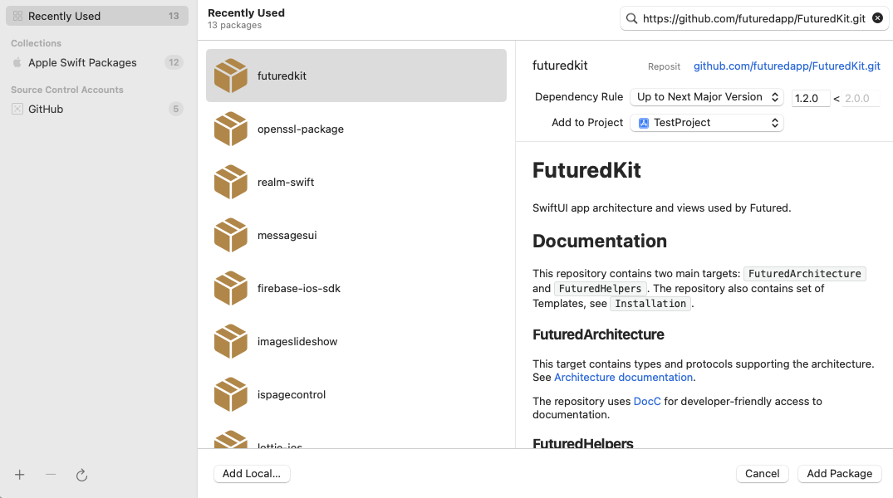{ width="500" }
                                    
                - add `FuturedArchitecture` to main project target
                - optionally add `FuturedHelpers` to main project target if needed - see [docs](https://github.com/futuredapp/FuturedKit?tab=readme-ov-file#futuredhelpers)
                
                    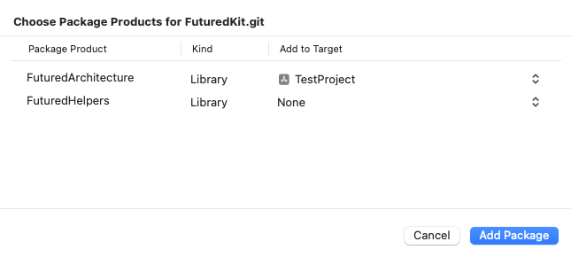{ width="500" }
                
                - go to the `{project_name}App.swift` file and remove error at line 10
                
                    ```swift
                    #error("Add https://github.com/futuredapp/FuturedKit.git to the project!")
                    ```
                
                    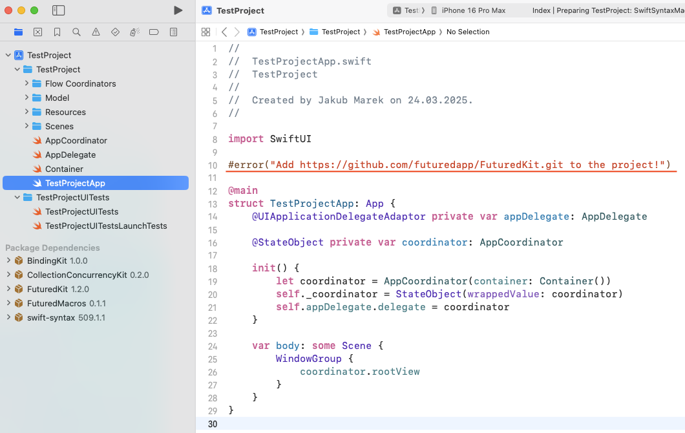{ width="900" }
                    
                - select `Issue navigator`, click the `Macro target ...` warning and then click `Trust & Enable` button
                
                    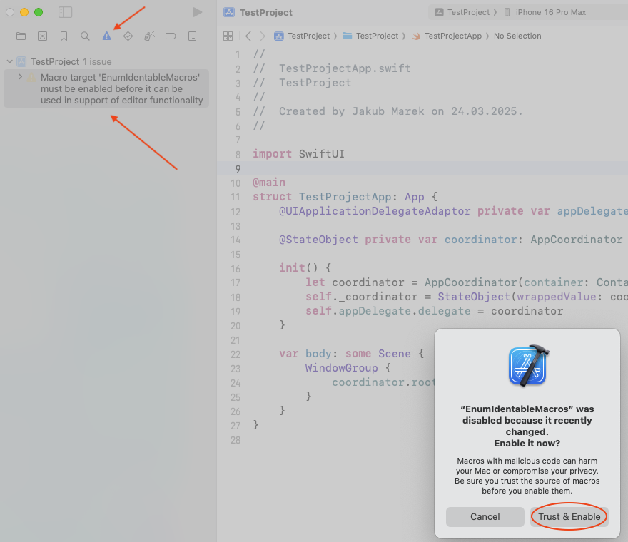{ width="900" }
                
            - add [SwiftLint](https://github.com/realm/SwiftLint)
            
                - if you don't have installed SwiftLint locally call `brew install swiftlint` from Terminal
                - go to `Build Phases` tab
                - click `+` button
                - click `New Run Script Phase`
                - rename phase to `SwiftLint` and move it before `Compile sources` phase
                - paste script bellow

                ```bash
                if test -d "/opt/homebrew/bin/"; then
                  PATH="/opt/homebrew/bin/:${PATH}"
                fi

                export PATH

                if which swiftlint >/dev/null; then
                    swiftlint --fix # remove `swiftlint --fix` if you want to fix linting issues manually
                    swiftlint
                else
                    echo "error: SwiftLint not installed, run: brew install swiftlint"
                fi
                ```
                
                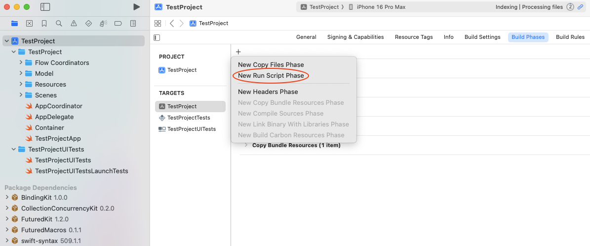{ width="900" }
                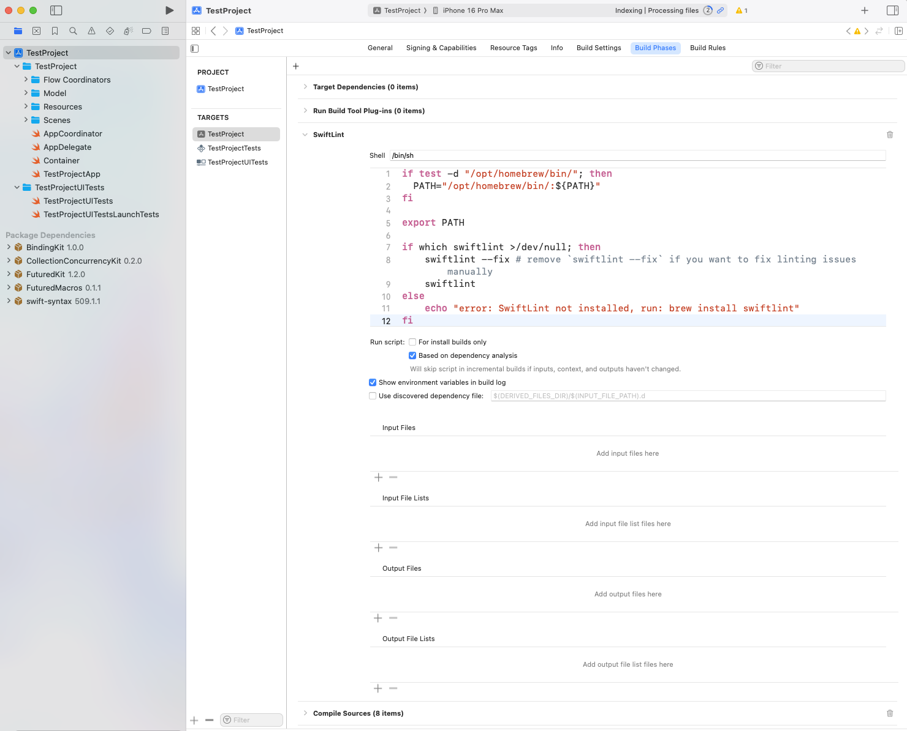{ width="900" }
                
                - disable `User Script Sandboxing` in `Build Settings`
                
                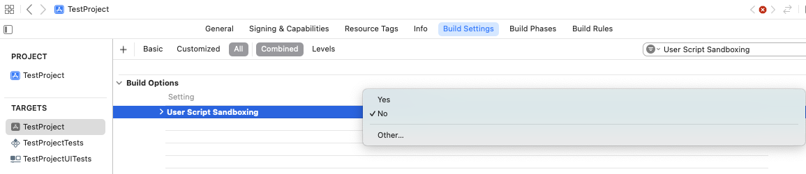{ width="500" }
                
            - configure the project for Continuous Deployment

                - set proper values in `Versioning` part of `Build Settings`
                
                    - select all targets and remove `Marketing Version` value by pressing `Delete` button on keyboard (`Marketing Version` text will change from bold to normal)
                    - select project and fill `1.0.0` as `Marketing Version`
                    
                    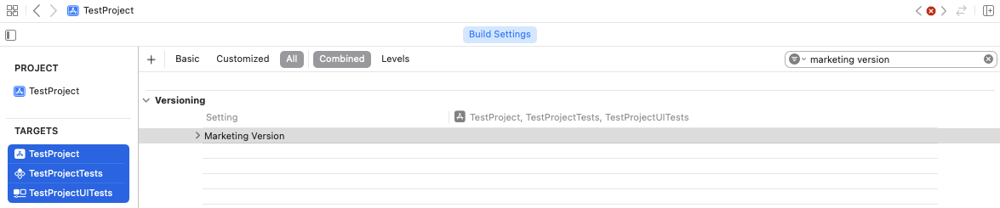{ width="900" }
                    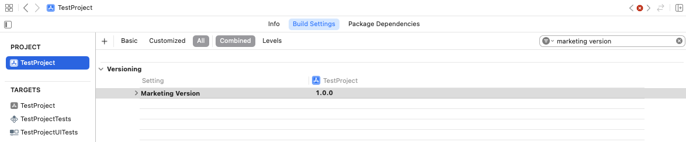{ width="900" }
                    
                - select appropriate provisioning profiles for all configurations in the Target's Signing & Capabilities tab
                
                    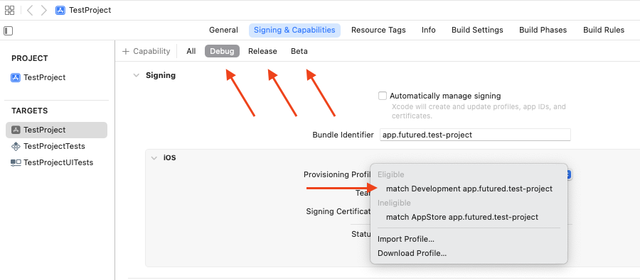{ width="900" }
                
            - build the project

5. Open pull request with the project setup

    ??? note "Steps"

        - update `.github/CODEOWNERS` file
            
            - change `@futuredapp/ios` to `@{github_username}` of teammate/teammates (or person who will perform code reviews)

        - update project README and fill in all the strike-through points
        - commit everything and open PR
        - after CI checks the PR, `test` check is now available to be added in `default branch protection` ruleset
        
            - add `test/test` check
            
            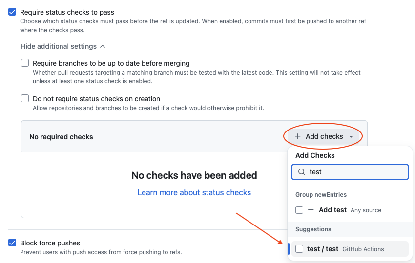{ width="900" }
            
            - added check looks like this
            
            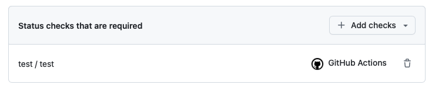{ width="500" }

6. Enjoy!
