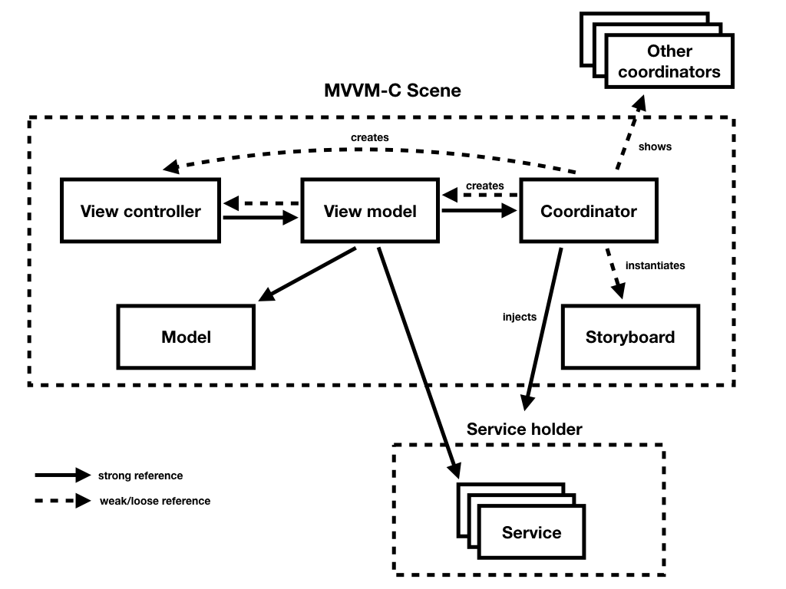

# Architecture

In Futured, we prefer our customized version of architecture described as MVVM-C (Model-View-ViewModel-Coordinator)
when using UIKit.

Our team is used to it. This means it dramatically improves our time to kick-off a project and maintain its development.
We can easily substitute developers. Onboarding of developers on a new project is faster too.
We only occasionally use a different architecture, if the product requires it or as a way to experiment and explore.

## Future directions

We are currently internally experimenting with uni-directional architectures in SwiftUI, namely:

- https://github.com/mkj-is/Elementary
- https://github.com/pointfreeco/swift-composable-architecture

We aim to formalize our process of developing SwiftUI applications during
the development of a first production SwiftUI for a client.

## MVVM-C

The basic MVC architecture introduced by Apple is defined pretty vaguely. If the developer is not careful
and has not strong sense of self-control the view controller often becomes omni-potent and has too
many responsibilities. Therefore this architecture introduces two more layers called view model and coordinator.

The view model is responsible for logic of each screen. The view controller should not handle any logic and only setup
the interface and present the data received from view model. Also the view controller sends all actions to view model
so it can handle them. The view model is the only layer, that handles state changes and the only place where the models
are held. The models are retrieved from services which are injected using simple dependency injection container called
the service holder.

Services are mainly used for encapsulating some low-level frameworks like communication with server or persistence.
They create higher-level API and enable simpler testing by mocking them.

The last layer in the MVVM-C architecture are coordinators (routers or navigators if you prefer).
Coordinator is responsible for setting up the scene, navigating to it, back from it and navigating to other screens.
In FuntastyKit there are some basic implementations of basic navigation patterns, namely push and modal.
Of course, the concept is not limited to these basic patterns and is highly configurable.

## Dependency injection

As a simple method for dependency injection a container called *service holder* is used.
At the start of the application, first coordinator called `AppCoordinator` sets up one container and instantiates/adds
the services to it, which are then available as singletons or multitons. Services can handle interaction with web APIs,
persistence and pack other system APIs. Each service is primarily a protocol, so all the services are easily testable
and mockable.

When the coordinator is navigating to other scenes, it passes the service holder along to them. The newly created
coordinator then injects all the services the view model needs for handling its logic using the constructor injection.

## Supporting frameworks

### FuntastyKit

[FuntastyKit](https://github.com/thefuntasty/FuntastyKit) is an open-source Swift framework containing
the architecture-related code and some regularly used UIKit extensions.

The key parts:

- *architecture/Coordinator.swift* – set of protocols and protocol extensions to back up the functionality
  of coordinators
- *architecture/ServiceHolder.swift* – a simple dependency injection container
- *autoLayout* – AutoLayout extensions
- *errors* – error structures and coordinator extensions unifying the error handling logic
- *extensions* – UI-related extensions
- *protocols* – Nibable for easy view initialization form xib, StoryboardType for type-safe references to storyboards

### Asynchronous programming

We use [PromiseKit](https://github.com/mxcl/PromiseKit) as a way to simplify asynchronous programming.
Promises are powerful, easy to learn mechanisms, allowing us to get rid of competition handlers without bringing
the complexity of a reactive framework.

Where appropriate, we're also open to more declarative approaches
such as [RxSwift](https://github.com/ReactiveX/RxSwift).
