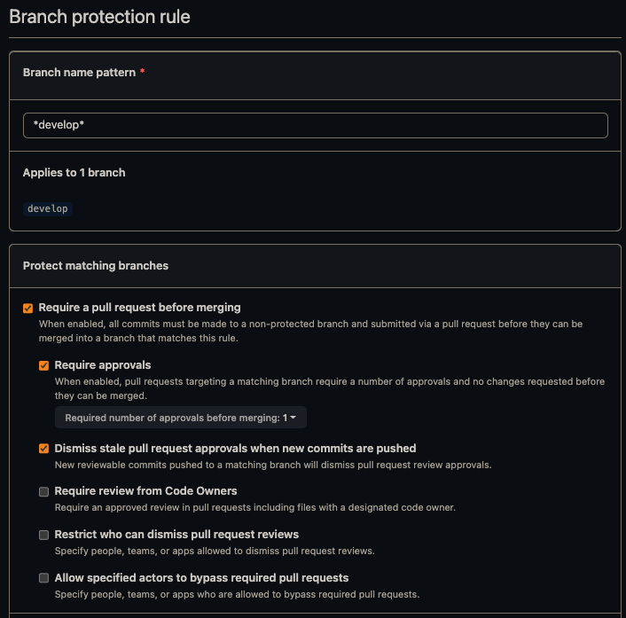

# New project checklist

## 1. Create new repository

- [ ] Open [iOS project template](https://github.com/futuredapp/iOS-project-template) and use it to create new repository. Preferred repo name is *[productname]-[platform]*, where *[productname]* includes only name of the product, without client name (like Skoda).
- [ ] Create `develop` branch and set is as a default branch.
- [ ] Disable **Wiki**, **Issues**, **Projects** features we do not use.
- [ ] Enable **Automatically delete head branches** so there is no need to delete branches manually after each PR merge.

- [ ] Set branch protection rules to `develop` and `main` branches exactly as shown in the following screenshot:



- [ ] Create new branch `feature/PROJ-1-setup-project` where everything will be set up in next steps.


## 2. Create a new Xcode project

- [ ] Write product name in CamelCased style. Organization Identifier is *app.futured*. Leave *Use Core Data* unchecked (persistence is usually implemented in much later phase of development) and *Include Unit Tests* and *Include UI Tests* checked.
- [ ] Change bundle identifier to kebab-cased style `app.futured.kebab-case-app-name`.

## 3. Configure Ruby environment and Fastlane

Update your Ruby using your preferred ruby version manager. and install latest version of dependency manager `gem install bundler`.

- [ ] Call `bundle install` to install gems.
- [ ] Edit `fastlane/Fastfile` to specify proper environment variables according to [imported Fastlane README](https://github.com/futuredapp/fastlane).
- [ ] Call `bundle exec fastlane create_apps`. This requires operations rights and you'll need to pass two factor authorization.

## 4. Add dependencies

If Swift Package manager will be used for dependecy management:

  - <https://github.com/futuredapp/FuturedKit> (SwiftUI project)
  - <https://github.com/futuredapp/FTAPIKit> (Project using REST API)
  - <https://github.com/futuredapp/FTTestingKit> (only to test target)

## 5. Configure SwiftLint

- [ ] Add a new Run Script Phase that executes the script (remove `swiftlint autocorrect` if you want to fix linting issues manually):

```
if which swiftlint >/dev/null; then
    swiftlint autocorrect
    swiftlint
else
    echo "error: SwiftLint not installed, run: brew install swiftlint"
fi
```

## 6. Configure the project for Continuous Deployment

- [ ] In Target's Signing & Capabilities tab, keep the Automatically manage signing checkbox unchecked.
- [ ] In Manage Schemes, set root project scheme as Shared.
- [ ] Run `bundle exec fastlane test` to check whether test can be run on both CI and locally.
- [ ] In Xcode, go to Project Info screen. In Configurations section, add a new configuration by duplicating the **Release** configuration and rename it to **Enterprise**.
- [ ] On Build Settings tab, look for Product Bundle Identifier, expand it to see preferences for Debug, Enterprise and Release configurations and for the Enterprise one, add suffix `.beta`.
- [ ] Select appropriate certificates, provisioning profiles for all configurations in the Signing section.
- [ ] Run `bundle exec fastlane enterprise` to check whether enteprise builds to App Center succeed.

## 7. Configure the project for automatic versioning

- [ ] Set proper values in Versioning part of Build Settings:
  - [ ] Change Marketing Version to `1.0.0` (only for new apps, add patch version if it is not present).
  - [ ] Change Current Project Version to `0` (only for new apps).
  - [ ] Change Versioning System to `Apple Generic`.
- [ ] Run `bundle exec fastlane increment_build_number` to see if everything is set up correctly and automatic increments work.

## 8. Configure continuous integration

Choose your CI service, we currently prefer Github Actions. We are slowly deprecating Bitrise.

### GitHub Actions

Most of the configuration is already part of the [iOS project template](https://github.com/futuredapp/iOS-project-template). All the secrets are provided by the organization. If they are not available ask someone with admin permissions to provide them to your repository.

### Bitrise

- [ ] Create a new Bitrise app by manually inserting GitHub SSH URL. Use "Add own SSH" option and paste our Bitrise-dedicated GitHub SSH key (can be found in 1Password vault).
- [ ] In Project build configuration step, select the manual one since our unified configuration will be pasted manually later.
- [ ] Let Bitrise to setup GitHub webhooks automatically.
- [ ] In Team tab, select `futured-bot` as the Service credential User and make sure `Futured` is the owner of the project.
- [ ] Add Futured **Developers** group as developers to the project.
- [ ] Instead of manually configuring the workflows using the GUI, paste the initial [bitrise.yml](attachments/bitrise.yml) file.
- [ ] Configure Secret Environment Variables:
	- `MATCH_PASSWORD`
	- `APP_STORE_CONNECT_API_KEY_KEY`
	- `APPCENTER_API_TOKEN`
	- `DANGER_GITHUB_API_TOKEN`
	- `SLACK_HOOK_URL`

- [ ] Finally, run test builds on Bitrise.

## 9. Setup App Center

***Note:** The app should be automatically created and submitted to App Center during step 6 by running `bundle exec fastlane enterprise` in Terminal.*

- [ ] Change owner to our organization.
- [ ] Add all internal teams as collaborators.
- [ ] Create distribution group for the client and invite them.

## 10. Open pull request with the project setup

- [ ] Update CODEOWNERS file.
- [ ] Update project README and fill in all the strike-through points.
- [ ] Commit everything and open PR and add this filled checklist to description.

## 11. Enjoy!
