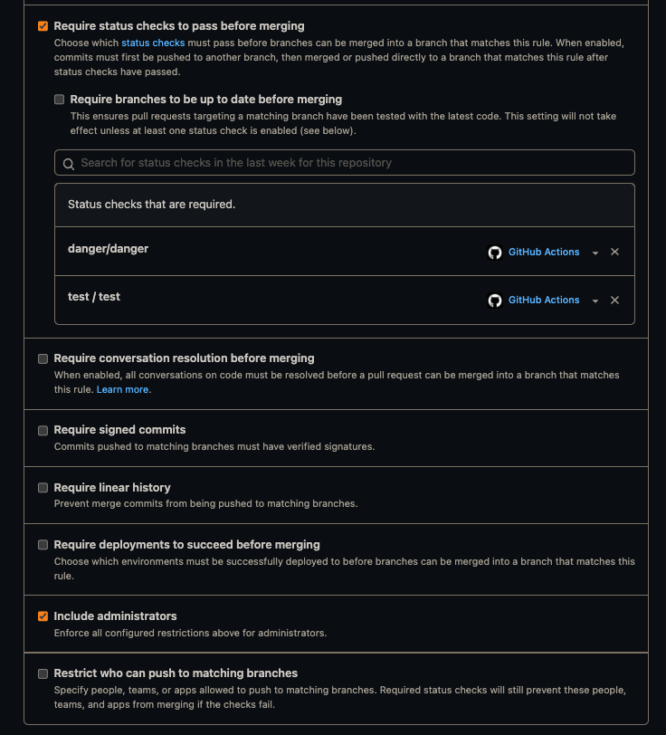
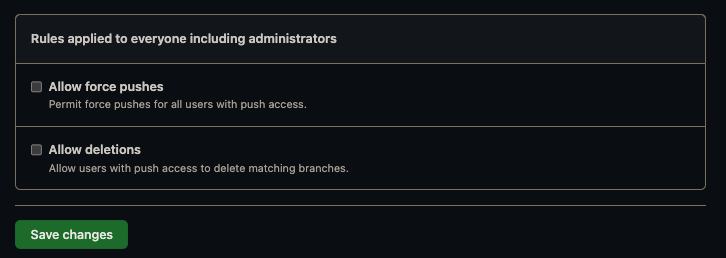

# New project checklist
***Note:** For more information check our [Project tools wiki](https://www.notion.so/futured/Project-tools-wiki-451531fedb8e4e1093e5e45bc4704227)*

## 1. Create new repository

- [ ] Open [iOS project template](https://github.com/futuredapp/iOS-project-template) and use it to create new repository. Preferred repo name is *[productname]-[platform]*, where *[productname]* includes only name of the product, without client name (like Skoda).
- [ ] Create `develop` branch and set is as a default branch.
- [ ] Go to Settings tab > General and disable **Wiki**, **Issues**, **Projects** features we do not use.
- [ ] Enable **Automatically delete head branches** so there is no need to delete branches manually after each PR merge. (repo - general settings)
- [ ] Add `Write` role to `futuredapp/ios` team in Access > Collaborators and teams.
- [ ] In Code and Automation > Branches, add branch protection rules to patterns `develop` and `main` branches exactly as shown in the following screenshot:


***Note:** Status checks may not be available yet. You will set them later.





- [ ] Create new branch `feature/PROJ-1-setup-project` where everything will be set up in next steps.


## 2. Create a new Xcode project

- [ ] Write product name in CamelCased style. Organization Identifier is *app.futured*. Leave *Use Core Data* unchecked (persistence is usually implemented in much later phase of development) and *Include Tests* checked. (CI requires tests run)
- [ ] Change bundle identifier to kebab-cased style `app.futured.kebab-case-app-name`.

## 3. Configure Ruby environment and Fastlane

Update your Ruby using your preferred ruby version manager. and install latest version of dependency manager `gem install bundler`.

- [ ] Call `bundle install` to install gems.
- [ ] Edit `fastlane/Fastfile` to specify proper environment variables according to [imported Fastlane README](https://github.com/futuredapp/fastlane).
- [ ] Call `bundle exec fastlane create_apps`. This requires operations rights and you'll need to pass two factor authorization.

## 4. Add dependencies

Add following dependecies using Swift Package manager:

- [ ] Remove `Podfile`.
- [ ] Open Xcode and add all relevant packages to the project

## 5. Configure SwiftLint

- [ ] Add a new Run Script Phase that executes the script (remove `swiftlint --fix` if you want to fix linting issues manually):

```
if test -d "/opt/homebrew/bin/"; then
  PATH="/opt/homebrew/bin/:${PATH}"
fi

export PATH

if which swiftlint >/dev/null; then
    swiftlint --fix
    swiftlint
else
    echo "error: SwiftLint not installed, run: brew install swiftlint"
fi
```

## 6. Configure the project for Continuous Deployment

- [ ] In Target's Signing & Capabilities tab, uncheck the *Automatically manage signing* checkbox.
- [ ] In Manage Schemes..., set root project scheme as Shared.
- [ ] Run `bundle exec fastlane test` to check whether test can be run on both CI and locally.
- [ ] In Xcode, go to Project Info screen. In Configurations section, add a new configuration by duplicating the **Release** configuration and rename it to **Beta**.
- [ ] On Build Settings tab for target (not project), look for Product Bundle Identifier, expand it to see preferences for Debug, Beta and Release configurations and for the Beta one, add suffix `.beta`.
- [ ] Select appropriate certificates, provisioning profiles for all configurations in the Target's Signing & Capabilities tab.
- [ ] Set proper values in Versioning part of Build Settings:
  - [ ] Change Marketing Version to `1.0.0`.
  - [ ] Change Current Project Version to `1`.
- [ ] Run `bundle exec fastlane beta` to check whether beta builds to TestFlight succeed.

## 7. Configure continuous integration

Choose your CI service, we currently prefer Github Actions.

### GitHub Actions

Most of the configuration is already part of the [iOS project template](https://github.com/futuredapp/iOS-project-template). All the secrets are provided by the organization. If they are not available ask someone with admin permissions to provide them to your repository.

## 8. Open pull request with the project setup

- [ ] Update CODEOWNERS file.
- [ ] Update project README and fill in all the strike-through points.
- [ ] Commit everything and open PR and add this filled checklist to description.
- [ ] After CI checks the PR, status checks are now available to be added in Branch protections settings. Add them.

## 9. Enjoy!
