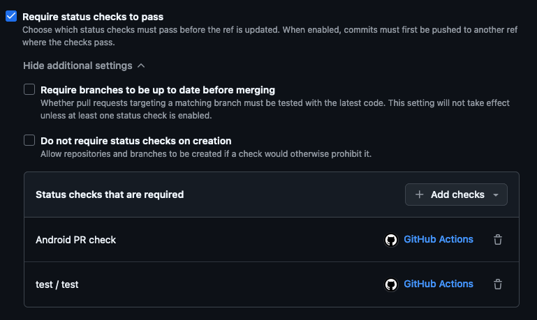

# New project checklist

## 1. Create new repository

- [ ] Open [KMP Futured template](https://github.com/futuredapp/kmp-futured-template) and use it to create new
  repository. Preferred repo name is *[productname]-kmp*, where *[productname]* includes only name of the product,
  without client name.

- [ ] Change following in newly created repository:
    - Update Readme.md
    - Change project name to real project name
    - Use `init_template.kts` script to change package name

- [ ] Make sure there are `develop` and `main` branches and `develop` is set as a default branch.

- [ ] Disable **Wiki**, **Issues**, **Projects** features we do not use.

- [ ] Enable **Automatically delete head branches** so there is no need to delete branches manually after each PR merge.

- [ ] Add branch ruleset `develop|main`
    - set targets as shown in the following screenshot:

- Set required approvals

- Set status checks

> (NOTE: Status checks (GitHub Actions, Danger, etc.) become visible after first created pull request. Do not forget to
> set them afterwards.

- [ ] Create new branch `feature/PROJ-1-setup-project` where everything will be set up in next steps.

## 2. Setup Firebase

- [ ] Create new Firebase project or get access to an existing one from the client.

- [ ] Create android apps for all build types - usually Debug, Enterprise and Prod
    - Make sure to set the package name correctly and add SHA certificate hashes

### App distribution

- [ ] Select enterprise project and click on `Get started` button.

- [ ] Add Tester group `Futured QA`. Create invite link and send it to the Slack channel.

- There are two ways of authorizing upload to Firebase.
    - Service account json, which is a **preferred way**
        1. Create service account in Google Cloud Console
        2. Select Firebase Products -> Firebase App Distribution Admin role
        3. Create new key with type `JSON`
        4. Create new repository secret `APP_DISTRIBUTION_SERVICE_ACCOUNT` with the json content
    - Using `FIREBASE_TOKEN`, which can be generated using Firebase CLI

## 3. Configure GitHub Actions

- [ ] In **Settings** tab of your repository, go to **Secrets** and configure following secrets:
    1. `APP_DISTRIBUTION_SERVICE_ACCOUNT`

- [ ] For each workflow configuration file, configure the environment variables marked with `TODO` comment
    1. `SLACK_CHANNEL`

- [ ] Make a pull request from `feature/PROJ-1-setup-project` to `develop` to ensure that GitHub Actions work properly

## 4. Enjoy!
