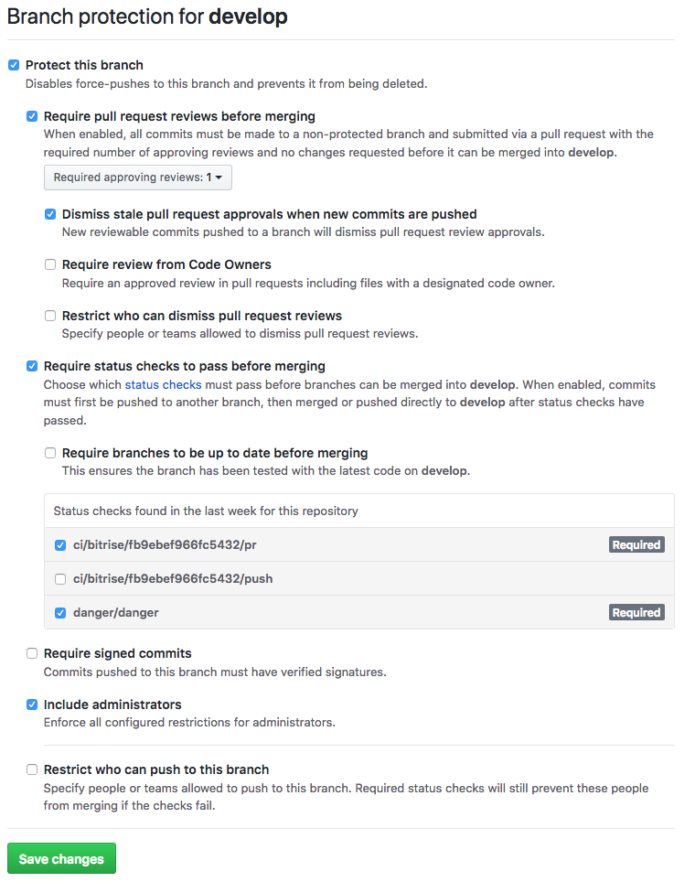

# New project checklist

## 1. Create a new Xcode project

Start with the "Single View App" template. Make sure Organization Name is *The Funtasty, s.r.o.* and Organization Identifier is *com.thefuntasty*. Leave *Use Core Data* unchecked and *Include Unit Tests* and *Include UI Tests* checked.

## 2. Configure Ruby environment and Fastlane

Copy contents of the [thefuntasty/fastlane](https://github.com/thefuntasty/fastlane) repo to the project dir. Call `bundle install` to install gems. 

Edit `fastlane/Appfile` and specify `ENV['APP_IDENTIFIER']`, `ENV['APP_NAME']`, `ENV['APP_SCHEME']`. If customer's Apple Developer account is already known, specify also `ENV['APP_IDENTIFIER_CUSTOMER']` and `ENV['TEAM_ID_CUSTOMER']`.

Call `bundle exec fastlane create_apps`. You will need admin rights for this, if you are not admin, ask someone to do this for you.

## 3. CocoaPods

Initialize CocoaPods by calling `bundle exec pod init`. To the Podfile, always add  SwiftLint and FuntastyKit and make sure the latest tagged version is referenced:
 
```
pod 'FuntastyKit', git: 'https://github.com/thefuntasty/FuntastyKit.git', tag: 'v1.1.1'
pod 'SwiftLint'
```
	
Unless stated differently, add *PromiseKit* pod, when localization is needed, add *BartyCrouch* pod.

## 4. Configure SwiftLint

Add a new script Build Phase below `[CP] Check Pods Manifest.lock` that executes the script:

```
if which ${PODS_ROOT}/SwiftLint/swiftlint >/dev/null; then
    ${PODS_ROOT}/SwiftLint/swiftlint
else
    echo "error: SwiftLint not installed, run `pod install`"
fi
```

Create a `.swiftlint.yml` in the project dir with contents of [this file](.swiftlint.yml).

## 5. Create GitHub repo

Preferred repo name is *[productname]-[platform]*, where *[productname]* include only name of the product, without client name (like Skoda). Set `develop` branch as a default branch and set Branch protecting rules to `develop` and `master` branches exactly as shown in the image.



## 6. Configure the project for Continuous Deployment

Use Fastlane Match to create an Enterprise provisioning profile. The command can look like this, make sure the bundle identifier match with the intended identifier for Enterprise deployment.

`bundle exec fastlane match enterprise -a com.thefuntasty.PROJECT.beta -u ops@thefuntasty.com -b YVMX5P3692`

In Xcode, go to Project Info screen. In Configurations section, add a new configuration by duplicating the Release configuration and name it `Enterprise`. On Build Settings tab, look for Product Bundle Identifier, expand it to see preferences for Debug, Enterprise and Release configurations and for the Enterprise one, add suffix `.beta`.

In Target's General tab, keep the Automatically manage signing checkbox unchecked and select appropriate certificate in the Signing (Enterprise) section. The certificate should be already there, if not, make sure Enterprise certificate and provisioning profile was correctly installed using the Fastlane Match.

An app have to have an icon before deploying a build to Funtaster. Add some at this point.

## 7. Configure Bitrise CI

Create a new Bitrise app by connecting to the GitHub repo. Paste our GitHub SSH key dedicated to Bitrise. 

In Team tab, select `thefuntasty-ops` as the Service credential User and make sure The `Funtasty Digital s.r.o.` is the owner of the project.

In Code tab, make sure Incoming Webhooks are set to `Github (Code Push, Pull Request, Tag Push)`, then go to GitHub repo and set up the webhook for the url shown on Bitrise. Activate the hook for *Pull requests* and *Pushes* events.

Instead of manually configuring the workflows using the GUI, paste the [initial bitrise.yml file](https://wiki.thefuntasty.com/doku.php?id=ios:bitrise) to the editor. Configure the *MATCH_PASSWORD* and *FASTLANE_PASSWORD* Secrets.

Finally, run a test build. Before seeing the build in Funtaster, you have to enable it in Funtaster administration.

> TODO: when configuring a new Bitrise app, make the guide more detailed

## 8. Enjoy!